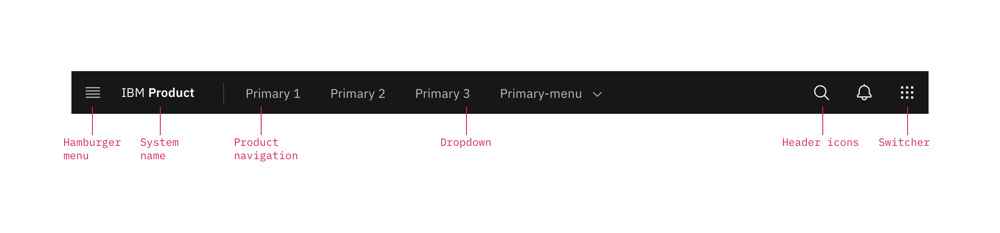

## General guidance

The UI shell is the highest level in a product’s UI. It consists of the primary header, as well as header panels that are used for navigation and global UI services. The shell is divided into two distinct “zones” which establish purpose and level of control.

The header’s architecture is structured to clarify meaning through placement along a left-to-right axis. The left side of the header, and its associated elements, represents the more "product" end of the spectrum, and contains items relevant at the product level. Moving to the right along the header, the functions become more global. Whereas elements in the middle of the header should represent system-level controls, elements on the right side of the header, such as the app switcher, are the most global in their scope, and span multiple systems. As a rule of thumb for the UI Shell, left-to-right translates to product-to-global.

### Shell components

The UI shell is delivered as separate Carbon components that can be used separately or concurrently. The UI shell is separated into different components to allow for detailed documentation for each component and to make it easier for additional UI shell components to be added in the future.

| Shell UI component      |   |
|-------------|---|
| Header      | The highest level of navigation. The header can be used on its own for simple products or be used to trigger the left and right panels.|
| Left panel  | An optional panel that is used for a product's local navigation.|
| Right panel | An optional panel that can show additional actions or content associated with an icon in the header.|

<ImageComponent cols="8"  caption="UI shell components">

</ImageComponent>

### System zone

The system zone contains the highest level navigation and functions which could include search, docs, support, profile, and notifications, and any corresponding panels. It also includes the universal app switcher. The contents of this zone are ideally controlled by the system “owner.” System owners can also choose to include custom top-nav text links in this zone.

<ImageComponent cols="8"  caption="UI shell system zone">

</ImageComponent>

## Primary header
The header spans the full width of the viewport and is the topmost element in the browser window. Header elements are persistent throughout the product experience..

<ImageComponent cols="12" caption="Primary header">

</ImageComponent>

### Header elements

**Hamburger menu:** The “hamburger” icon is used to open left-side nav panels (if they are used in the product’s UI). If no collapsible left-nav panels are included as part of normal use, but the UI does utilize top-nav items, then the hamburger icon should appear at narrow breakpoints to accommodate the top nav items, which will flow into the menu. [reference hamburger icon path and visual]

**System name:** For IBM products, the system name is always preceded by “IBM.”

**Primary navigation:** Up to five optional horizontal top-level nav links and/or dropdown menus are allowed. These links drop down to the side menu in narrow screen widths.

**Dropdown:** include the down-pointing chevron after the link label. Dropdowns open on click and are closed by either selecting an item in the menu, clicking outside the menu area, or clicking on the menu label. When open, the chevron should point up. Dropdown menu labels serve only to open the dropdown; they cannot link to another page in the product.

**L0 icons:** These icons are reserved for universal, system-level functions such as profile, search, notifications, and similar functions. Not every product on a system is required to show the same L0 icons, but it is recommended for better cross-product user experience.

**App switcher:** The app switcher provides a way for the user to easily switch between products and systems. Recommended uses for this component include recently used apps, frequently used apps, all apps attached to the user’s account, or, if the list is of a manageable size, all apps or products available on the system. Links to related systems should also live in the app switcher, as should a link to IBM.com.

### Icon placement

Icons are not a required element of the header and a product may choose to use any set of icons for their UI. The guidance provided is meant to help create consistency in your user's expectations and experience across products.  

<ImageComponent cols="8" >

</ImageComponent>

|Icon | Position|  |
|-----|-----|---|
|Search|Left|Search should always be positioned as the furthest left icon. This is to allow for a expanding search field that does not disrupt other icon positions. |
|Other|Right of Search and left of core icons| The number of header icons a product uses may vary. This placement will help avoid disrupting the position of the core icons and inconsistencies as your user navigates between other product shell headers. 
|Help|4th from the right||
|Notifications|3rd from the right||
|Account|2nd from the right||
|Switcher|Right||

## Responsive behavior

As a header scales down to fit smaller screen sizes, header links and menus should collapse into a left-nav “hamburger” menu. See the examples below to better understand the header's responsive behavior. If your UI includes a side-nav panel, then the header links should be added above the left-nav, pushing it down accordingly.

<ImageComponent cols="12" caption="Header responsive behavior">

</ImageComponent>

