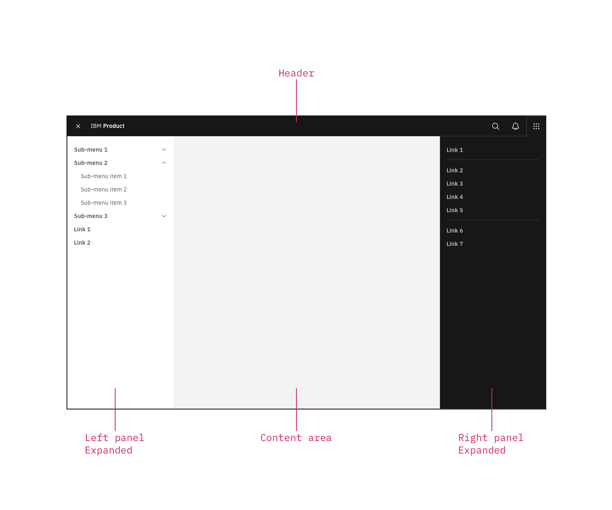
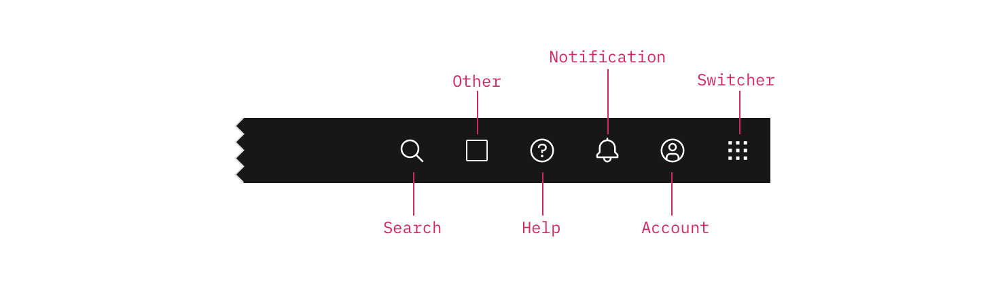

### This header is part of the Carbon UI shell. A shell is a collection of components shared by all products within a platform. It provides a common set of interaction patterns that persist between and across products. 

<AnchorLinks>

- [General guidance](#general-guidance)
- [Anatomy](#anatomy)
- [Behavior](#behavior)

</AnchorLinks>

<ImageComponent cols="8"  caption="UI shell header">

</ImageComponent>

## General guidance

The [UI shell](/patterns/navigation) is made up of three components: The primary header, the [left panel](/components/UI-shell-left-panel/usage), and the [right panel](/components/UI-shell-right-panel/usage). All three can be used independently, but the components were designed to work together.

| Shell UI component      |   |
|-------------|---|
| Header      | The highest level of navigation. The header can be used on its own for simple products or be used to trigger the left and right panels.|
| Left panel  | An optional panel that is used for a product's local navigation.|
| Right panel | An optional panel that can show additional actions or content associated with an icon in the header.|

<ImageComponent cols="8"  caption="UI shell components">

</ImageComponent>

For each UI shell component, left-to-right translates to product-to-global. The left side of the header contains items relevant at the product level. Moving to the right along the header, the functions become more global. Elements in the middle of the header should represent system-level controls. Elements on the right side of the header, such as the app switcher, are the most global in their scope and span multiple products. 

## Anatomy

The header spans the full width of the viewport and is the topmost element in the browser window. Header elements are persistent throughout the product experience.

<ImageComponent cols="12" caption="Primary header">

</ImageComponent>

### Header elements

#### Hamburger menu

The hamburger icon is used to open left-side navigation panels. If no collapsible left-nav panels are included as part of normal use, but the UI does utilize top-nav items, then the hamburger icon should appear at narrow breakpoints to accommodate the top nav items, which will flow into the menu. [reference hamburger icon path and visual]

#### System name

For IBM products, the system name is always preceded by “IBM.” --- IS THIS RIGHT? ---

#### Primary navigation

Up to five top-level nav links and/or dropdown menus are allowed. These links drop down to the side menu in narrow screen widths.

#### Dropdown

Include the down-pointing chevron after the link label. Dropdowns open on click and are closed by either selecting an item in the menu, clicking outside the menu area, or clicking on the menu label. When open, the chevron should point up. Dropdown menu labels serve only to open the dropdown; they cannot link to another page in the product.

#### L0 icons

These icons are reserved for universal, system-level functions such as profile, search, notifications, and similar functions. Not every product on a system is required to show the same L0 icons, but it is recommended for a better cross-product user experience.

#### App switcher

The app switcher provides a way for the user to easily switch between products and systems. Recommended uses for this component include recently used apps, frequently used apps, or all apps attached to the user’s account. If the list is a manageable size, include all apps or products available on the system. 

Links to related systems should also live in the app switcher. If you're building a product for IBM, your app switcher should include a link to IBM.com.

### Icon placement

Icons are not a required element of the header and a product may choose to use any set of icons for their UI. The guidance provided is meant to help create consistency in your user's expectations and experience across products.  

<ImageComponent cols="8" >

</ImageComponent>

|Icon | Position|  |
|-----|-----|---|
|Search|Left|Search should always be positioned as the furthest left icon. This is to allow for a expanding search field that does not disrupt other icon positions. |
|Other|Right of Search and left of core icons| The number of header icons a product uses may vary. This placement will help avoid disrupting the position of the core icons and inconsistencies as your user navigates between other product shell headers. 
|Help|4th from the right||
|Notifications|3rd from the right||
|Account|2nd from the right||
|Switcher|Right||

## Behavior

As a header scales down to fit smaller screen sizes, header links and menus should collapse into a left-nav hamburger menu. See the examples below to better understand the header's responsive behavior. 

If your UI includes a side-nav panel, the header links should be added above the left-nav, pushing it down accordingly.

<ImageComponent cols="12" caption="Header responsive behavior">

</ImageComponent>
