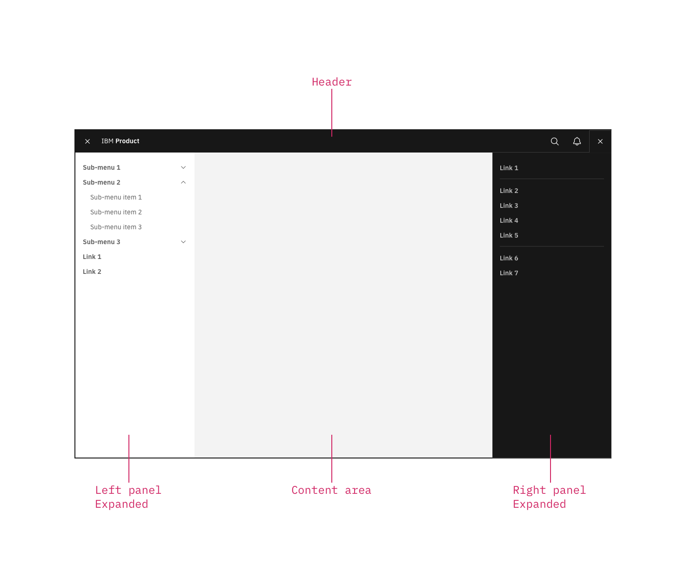
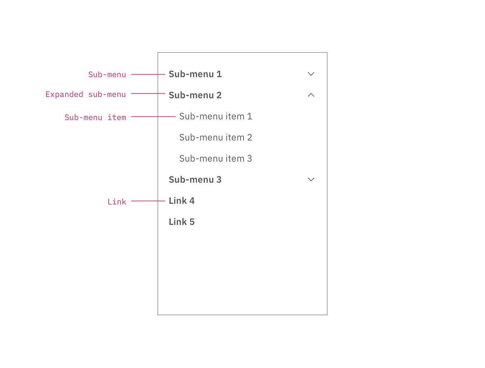

### This left panel is part of the Carbon UI shell. A shell is a collection of components shared by all products within a platform. It provides a common set of interaction patterns that persist between and across products. 

## General guidance

The UI shell is made up of three components: The [primary header](/components/UI-shell-header/usage), the left panel, and the [right panel](/components/UI-shell-right-panel/usage). All three can be used independently, but the components were designed to work together.

| Shell UI component      |   |
|-------------|---|
| Header      | The highest level of navigation. The header can be used on its own for simple products or be used to trigger the left and right panels.|
| Left panel  | An optional panel that is used for a product's local navigation.|
| Right panel | An optional panel that can show additional actions or content associated with an icon in the header.|

<ImageComponent cols="8"  caption="UI shell components">

</ImageComponent>

## Anatomy

The left panel contains secondary navigation and is positioned below the header and fixed to the left. Both links and sub-menus can be used in the side-nav and may be mixed together.

<ImageComponent cols="8"  caption="Left panel with nested sub-menus.">

</ImageComponent>

## Usage

Us the left panel if there are more than five secondary navigation items or your user are expected to switch between secondary items frequently. If tabs are needed on a page when using a side-nav, then the tabs are secondary in hierarchy to the side-nav.

Limit the number of nested sub-menu items to one.