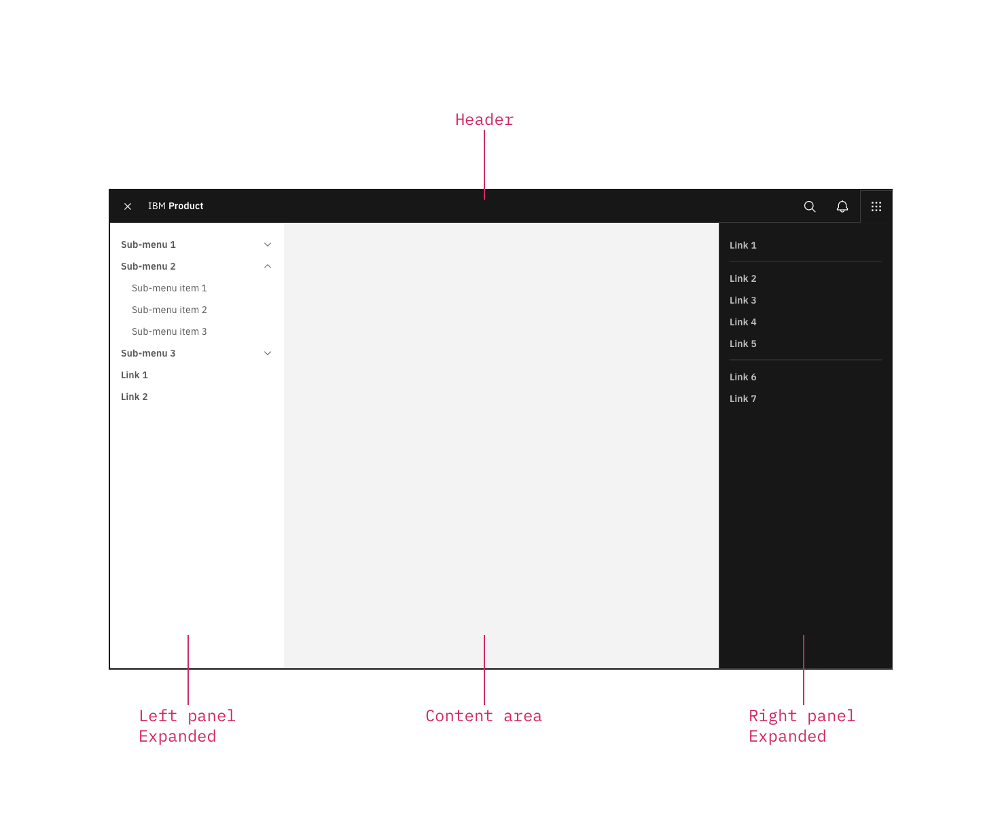
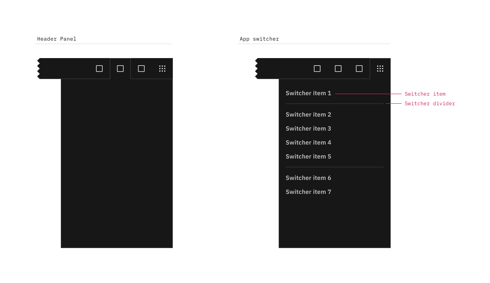
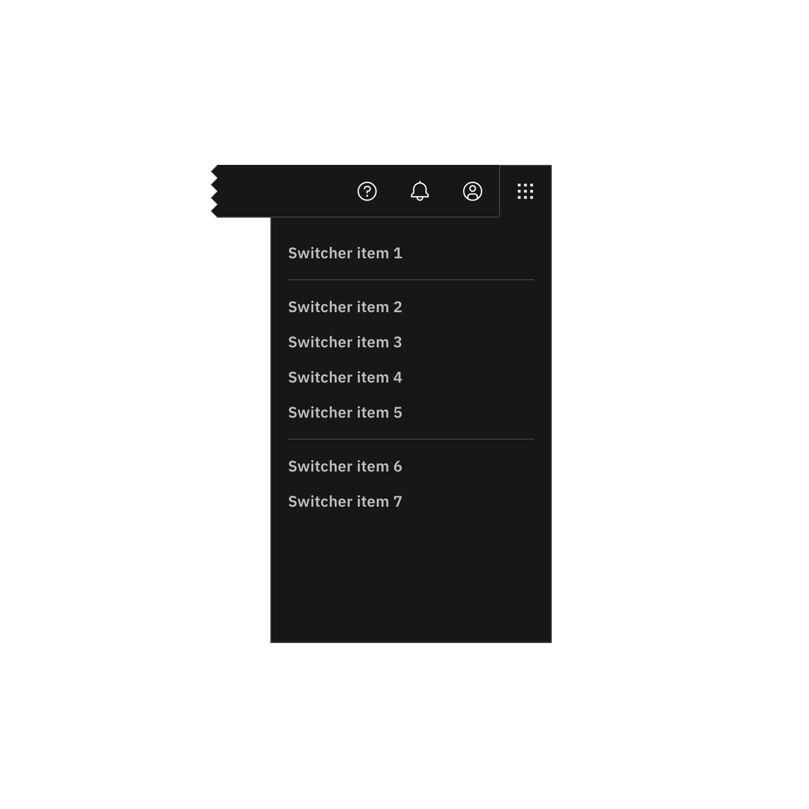
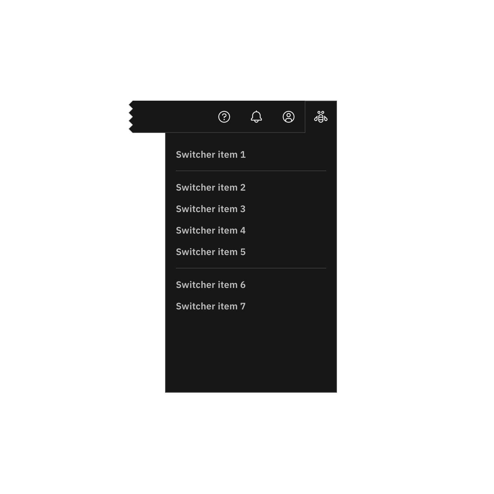

### The right panel is part of the Carbon UI shell. A shell is a collection of components shared by all products within a platform. It provides a common set of interaction patterns that persist between and across products. 

<AnchorLinks>

- [General guidance](#general-guidance)
- [Anatomy](#anatomy)
- [Behavior](#behavior)

</AnchorLinks>

## General guidance

The UI shell is made up of three components: The [primary header](/components/UI-shell-header/usage), the [left panel](/components/UI-shell-right-panel/usage), and the right panel. All three can be used independently, but the components were designed to work together.

| Shell UI component      |   |
|-------------|---|
| Header      | The highest level of navigation. The header can be used on its own for simple products or be used to trigger the left and right panels.|
| Left panel  | An optional panel that is used for a product's local navigation.|
| Right panel | An optional panel that can show additional actions or content associated with an icon in the header.|

<ImageComponent cols="8"  caption="UI shell components">

</ImageComponent>

## Anatomy

The right panel is invoked by icons on the right side of the header, and remains anchored to that icon. Right panels have a consistent width, span the full height of the viewport, and are flush to the right edge of the viewport.

Note that the app switcher also lives in a right panel.

<ImageComponent cols="12"  caption="The right panel configured as an empty header panel (left) and a app switcher (right).">

</ImageComponent>

#### Switcher item

A switcher item is anything that changes what product, offering, or property occupies the UI shell. Consider moments in a product when you switch from a calendar to a mailbox, from Kubernetes to Catalog. These items belong in the switcher.

#### Switcher divider

A switcher divider groups similar switcher items. You can use a divider to set apart a parent domain, group child domains similar in hierarchy to the parent, and set apart additional resources. The divider should not be used to separate every switcher item.

### App switcher

The far right header icon is reserved for the app switcher icon. The app switcher icon and the app switcher panel should only be used together.

<Row>
<Column offsetLg="4" colMd="4" colLg="6">
  <DoDontExample correct label="Positioned the app switcher to the far right.">

  </DoDontExample>
</Column>
<Column colMd="4" colLg="6" >
  <DoDontExample  label="Do not position other icons to the right of the app switcher.">

  </DoDontExample>
</Column>
<Column offsetLg="4" colMd="4" colLg="6" >
  <DoDontExample  label="Do not use another icon for the app switcher.">

  </DoDontExample>
</Column>
</Row>

## Behavior

#### Expansion

Right panels always float over page content, and always remain anchored to their associated icon. You can have multiple right panels, but only only one can be expanded at any time.

#### Dismissal

Once expanded, the panel's associated icon becomes an “✕”. To dismiss the panel, a user must click or tap the “✕”.

#### Selected state

There is no selected state for right panel items. Even if a user is currently within one of the panel items, the item remains unselected.
