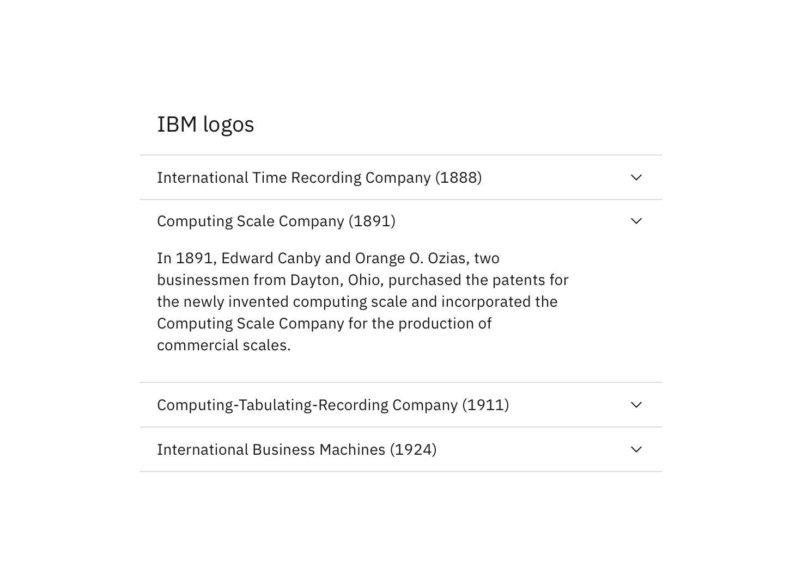

## General guidelines

Accordions are best used when users need to consume specific areas of content within a page or when vertical space is limited.

Use Accordions when there is enough content to condense. Avoid nested Accordions because it increases the cognitive load for users.

Users may have multiple Accordions open at the same time. The entire header area is clickable to expand or collapse the content below.

