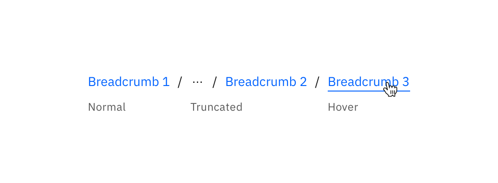
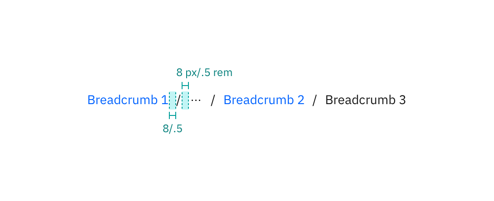
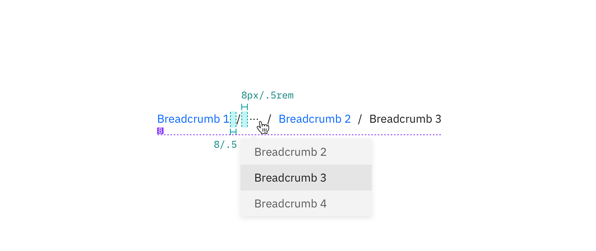

---

title: Breadcrumb
tabs: ['Code', 'Usage', 'Style']
---

## Color

| Class                         | Property | SCSS                |
| ----------------------------- | -------- | ------------------- |
| `.bx--link`                   | color    | $brand-01           |
| `.bx--link:hover`             | color    | $hover-primary-text |
| `.bx--breadcrumb-item::after` | color    | $text-02            |

## Typography

When a user hovers overs a Breadcrumb, the Breadcrumb title should be underlined.

| Class       | Font-size (px/rem) | Font-weight | Type style |
| ----------- | ------------------ | ----------- | ---------- |
| `.bx--link` | 14 / 0.875         | Roman / 400 | -          |

_Breadcrumb typography treatment example_

## Structure

The on-click dropdown should follow the [Overflow Menu](/components/overflow-menu) specs for sizing, padding, and interaction.

| Class                         | Property    | px/rem | Spacing token |
| ----------------------------- | ----------- | ------ | ------------- |
| `.bx--breadcrumb-item::after` | margin-left | 16 / 1 | $spacing-md   |

_Structure and spacing measurements for Breadcrumb | px / rem_

## Recommended

Truncated breadcrumbs are not currently built into the Breadcrumb component. The following colors from the [Overflow Menu](/overflow/style) are recommended for the overflow Breadcrumb list.

### Color

| Class                                      | Property         | SCSS       |
| ------------------------------------------ | ---------------- | ---------- |
| `.bx--overflow-menu-options__btn`          | color            | $text-01   |
| `.bx--overflow-menu-options__option:hover` | background-color | $hover-row |

### Typography

| Class                             | Font-size (px/rem) | Font-weight | Font style |
| --------------------------------- | ------------------ | ----------- | ---------- |
| `.bx--overflow-menu-options__btn` | 14 / 0.875         | Roman / 400 | -          |

### Structure

| Class                        | Property   | px / rem | Spacing token |
| ---------------------------- | ---------- | -------- | ------------- |
| `.bx--overflow-menu-options` | margin-top | 8 / 0.5  | $spacing-xs   |

_Recommended structure and spacing measurements for Breadcrumb | px / rem_
