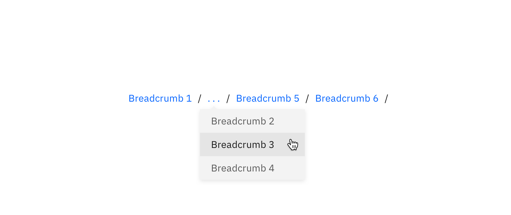

## Usage

Breadcrumbs enable users to quickly see their location within a path of navigation and move up to a parent level if desired. Each tier of the Breadcrumb should be clickable.

## Best practices

- Breadcrumbs should not replace primary navigation.
- You can have one Breadcrumb to show that the user is one-level deep.
- In this case, the clicking the single, stand-alone Breadcrumb would act as a Back button to lead the user to the previous screen.
- Place Breadcrumbs near the top of the page.
- Show hierarchy, not history.
- Keep Breadcrumb titles short but descriptive.
- Do not use a Breadcrumb if you are taking users through a multi-step process (use a [Progress Indicator](/components/progress-indicator) for this.)

## Multiple tiers

If there are more than three levels, the home level and the last two levels are visible, with all middle levels being collapsed into ellipses and accessible from a dropdown. For styling of the Dropdown, refer to the [Overflow Menu](/components/overflow-menu).

