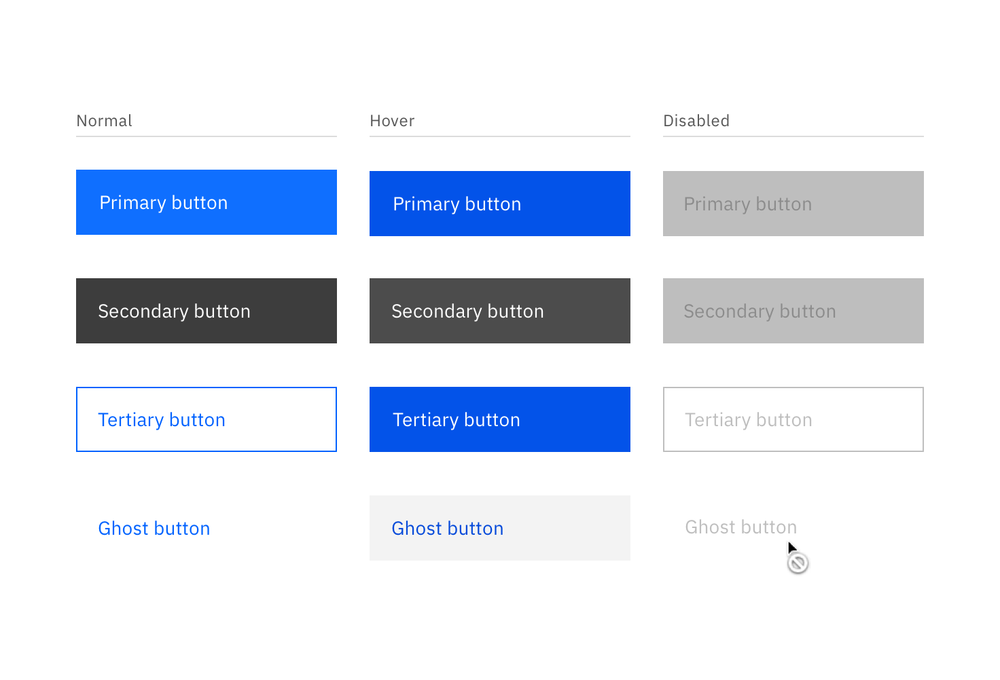
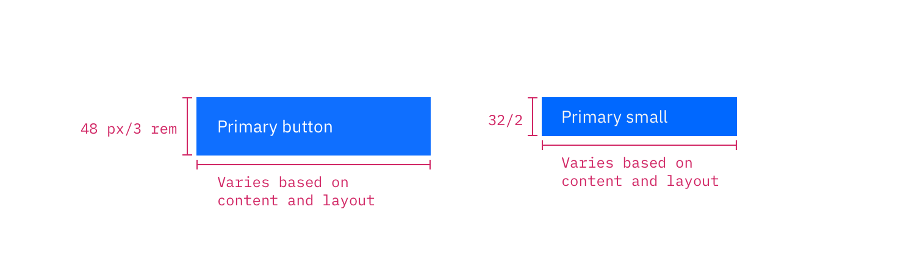
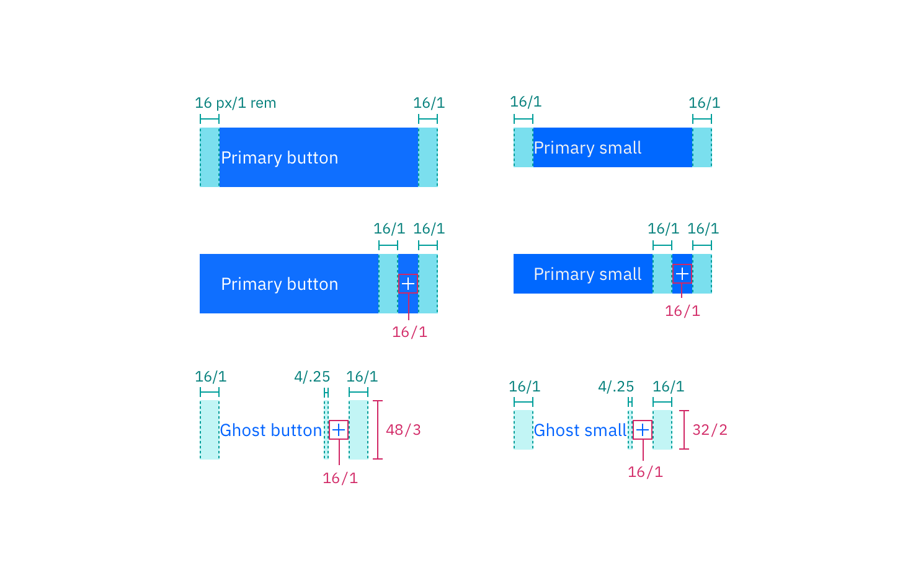

---

title: Button
tabs: ['Code', 'Usage', 'Style']
---

## Color

| Class                                                          | Property                 | SCSS             |
| -------------------------------------------------------------- | ------------------------ | ---------------- |
| `.bx--btn--primary`                                            | text color               | $inverse-01      |
| `.bx--btn--primary`   `.bx--btn--secondary`                | background-color, border | $brand-01        |
| `.bx--btn--primary:hover`                                      | background-color         | $hover-primary   |
| `.bx--btn--primary:disabled`                                   | opacity                  | $brand-01        |
| `.bx--btn--secondary`                                          | text color               | $brand-01        |
| `.bx--btn--secondary`                                          | border                   | $brand-01        |
| `.bx--btn--secondary:hover`                                    | background-color         | $hover-secondary |
| `.bx--btn--secondary:hover`                                    | text color               | $inverse-01      |
| `.bx--btn--tertiary`                                           | text color               | $inverse-01      |
| `.bx--btn--tertiary`                                           | background-color         | $ui-05           |
| `.bx--btn--tertiary:hover`                                     | background-color         | $ui-05           |
| `.bx--btn--danger--primary`  `.bx--btn--danger--secondary` | background-color         | $support-01      |
| `.bx--btn--danger--primary:hover`                              | background-color         | $hover-danger    |
| `.bx--btn--danger--secondary:hover`                            | border                   | $support-01      |

<image-component fixed="default" caption="Primary, secondary, and ghost button state examples">

</image-component>

## Typography

Button text should be set in sentence case, with only the first word in a phrase and any proper nouns capitalized.

| Class      | Font-size (px/rem) | Font-weight     | Type style       |
| ---------- | ------------------ | --------------- | ---------------- |
| `.bx--btn` | 14 / 0.875         | Semi-Bold / 600 | `.bx--type-zeta` |

## Structure

A button cannot have any element or text within 16 pixels / 1 rem of its borders. For button groups, the primary button is positioned on the outside of the set, while the secondary button is positioned inside. For a button with a glyph, the space between the button label and the glyph must be greater than or equal to 16 pixels / 1 rem. This is to accommodate for instances where two or more buttons with glyphs appear together.

| Class                            | Property                    | px / rem | Spacing token |
| -------------------------------- | --------------------------- | -------- | ------------- |
| `.bx--btn--primary`              | height                      | 40 / 2.5 | $spacing-2xl  |
| `.bx--btn--sm`                   | height                      | 32 / 2   | $spacing-xl   |
| `.bx--btn`                       | padding-left, padding-right | 16 / 1   | $spacing-md   |
| `.bx--btn--sm`                   | padding-left, padding-right | 16 / 1   | $spacing-md   |
| `.bx--btn .bx--btn__icon`        | margin-left, margin-right   | 8 / 0.5  | $spacing-xs   |
| `.bx--btn--ghost .bx--btn__icon` | margin-left, margin-right   | 8 / 0.5  | $spacing-xs   |

<image-component fixed="default" caption="Structure measurements for small and regular primary button | px / rem">

</image-component>

<image-component fixed="default" caption="Spacing measurements for various button types | px / rem">

</image-component>

### Recommended

The following specs are not built into any of the button components but are recommended by design as the proper distance between buttons.

| Attribute        | Property                  | px / rem   | Spacing token |
| ---------------- | ------------------------- | ---------- | ------------- |
| External: button | margin                    | 10 / 0.625 | -             |
| Button pairings  | margin-left, margin-right | 8 / 0.5    | $spacing-xs   |
