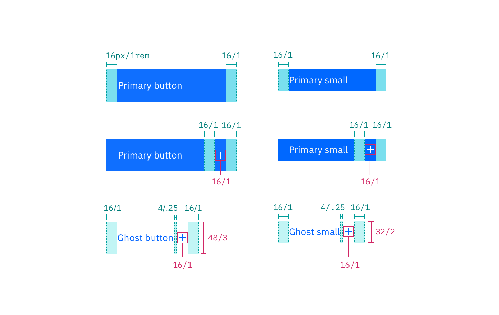

## Color

| Class                                                          | Property                 | SCSS             | HEX                    |
| -------------------------------------------------------------- | ------------------------ | ---------------- | ---------------------- |
| `.bx--btn--primary`   `.bx--btn--secondary`                | background-color, border | $brand-01        | #3d70b2                |
| `.bx--btn--primary:hover`                                      | background-color         | $hover-primary   | #30588c                |
| `.bx--btn--primary:disabled`                                   | opacity                  | $brand-01        | #3d70b2 at 50% opacity |
| `.bx--btn--secondary:hover`                                    | background-color         | $hover-secondary | #3d70b2                |
| `.bx--btn--tertiary`                                           | background-color         | $ui-05           | #5a6872                |
| `.bx--btn--tertiary:hover`                                     | background-color         | $ui-05           | #5a6872                |
| `.bx--btn--danger--primary`  `.bx--btn--danger--secondary` | background-color         | $support-01      | #e0182d                |
| `.bx--btn--danger--primary:hover`                              | background-color         | $hover-danger    | #bd1427                |
| `.bx--btn--danger--secondary:hover`                            | border                   | $support-01      | #e0182d                |

  

    
  

  

    
  

  

    
  

  

    
  

  

    
  

  

    
  

  

    
  

  

    
  

  

    
  

_Primary, Secondary, and Ghost Button state examples_

## Typography

Button text should be set in sentence case, with only the first word in a phrase and any proper nouns capitalized.

| Class      | Font-size (px/rem) | Font-weight     | Type style       |
| ---------- | ------------------ | --------------- | ---------------- |
| `.bx--btn` | 14 / 0.875         | Semi-Bold / 600 | `.bx--type-zeta` |

## Structure

A Button cannot have any element or text within 16 pixels / 1 rem of its borders. For Button groups, the primary button is positioned on the outside of the set, while the secondary button is positioned inside. For a Button with a glyph, the space between the button label and the glyph must be greater than or equal to 16 pixels / 1 rem. This is to accommodate for instances where two or more buttons with glyphs appear together.

| Class                            | Property                    | px / rem | Spacing token |
| -------------------------------- | --------------------------- | -------- | ------------- |
| `.bx--btn--primary`              | height                      | 40 / 2.5 | $spacing-2xl  |
| `.bx--btn--sm`                   | height                      | 32 / 2   | $spacing-xl   |
| `.bx--btn`                       | padding-left, padding-right | 16 / 1   | $spacing-md   |
| `.bx--btn--sm`                   | padding-left, padding-right | 16 / 1   | $spacing-md   |
| `.bx--btn .bx--btn__icon`        | margin-left, margin-right   | 8 / 0.5  | $spacing-xs   |
| `.bx--btn--ghost .bx--btn__icon` | margin-left, margin-right   | 8 / 0.5  | $spacing-xs   |

  

    
  

  

    
  

_Structure measurements for small and regular Primary Button | px / rem_

  

    
  

  

    
  

  

    
  

  

    
  

  

    
  

  

    
  

_Spacing measurements for various Button types | px / rem_

### Recommended

The following specs are not built into any of the Button components but are recommended by design as the proper distance between Buttons.

| Attribute        | Property                  | px / rem   | Spacing token |
| ---------------- | ------------------------- | ---------- | ------------- |
| External: button | margin                    | 10 / 0.625 | -             |
| Button pairings  | margin-left, margin-right | 8 / 0.5    | $spacing-xs   |
