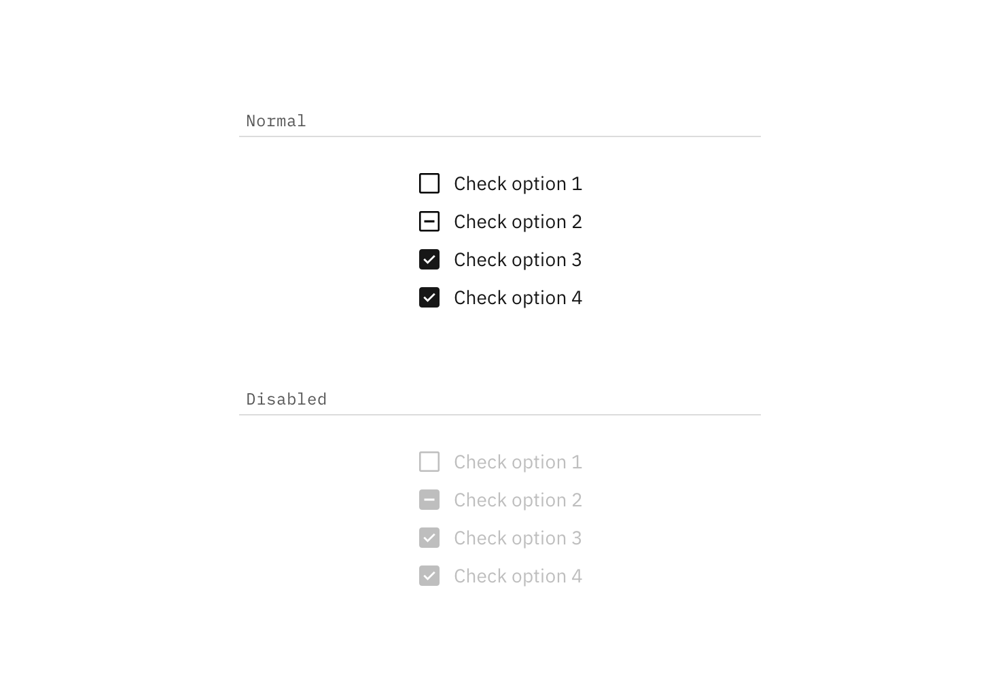

## Color

| Class                          | SCSS        | HEX         |
|--------------------------------|-------------|-------------|
|`.bx--checkbox:checked`         | $brand-01   | #3d70b2     |
|`.bx--checkbox-label::before`   | $ui-05      | #5a6872     |
|`.bx--checkbox-label::before`   | $ui-01      | #ffffff     |
|`.bx--checkbox-label::after`    | $inverse-01 | #ffffff     |
|`.bx--checkbox-label`           | $text-01    | #152935     |

  

    
  

  

    
  

_Disabled and normal Checkbox states_

## Typography

Checkbox headings and labels should be sentence case, with only the first word in a phrase and any proper nouns capitalized. Checkbox headings and labels should not exceed three words.

| Class                | Font-size (px/rem)| Font-weight   | Type style       |
|----------------------|-------------------|---------------|------------------|
| `.bx--label`         | 14 / 0.875        | SemiBold / 600| `.bx--type-zeta` |
| `.bx--checkbox-label`| 14 / 0.875        | Normal / 400  |  -               |

## Structure

| Class                                | Property             | px / rem  | Spacing token |
|--------------------------------------|----------------------|-----------|---------------|
|`.bx--checkbox-label::before`         | height & width       | 18 / 2.75 | -             |
|`.bx--checkbox-label::before`         | border               | 2  / -    | -             |
|`.bx--checkbox-label`                 | padding-left         | 8  / 0.5  | $spacing-xs   |
|`.bx--form-item.bx--checkbox-wrapper` | margin-bottom        | 16 / 1    | $spacing-md   |

---
***
> 

_Structure and spacing measurements for Checkbox | px / rem_
