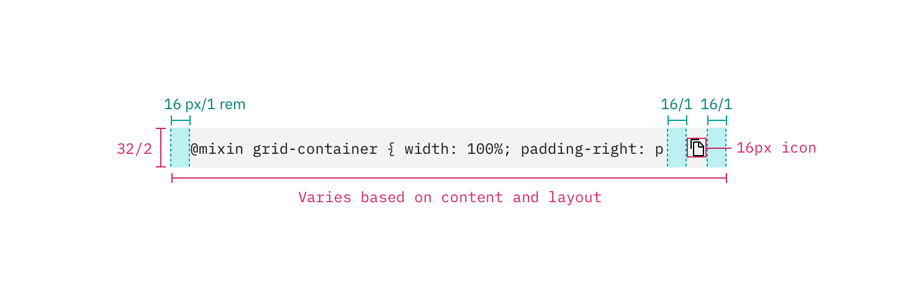
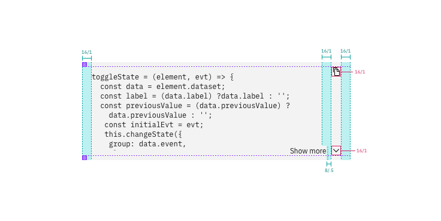

---

title: Code Snippet
tabs: ['Code', 'Usage', 'Style']
---

## Color

| Class                        | Property         | SCSS       |
| ---------------------------- | ---------------- | ---------- |
| `.bx--snippet--single`       | background       | $ui-01     |
| `.bx--snippet--single`       | border           | $ui-03     |
| `.bx--snippet__icon`         | color            | $brand-01  |
| `.bx--snippet--inline`       | background-color | $field-01  |
| `.bx--snippet--inline`       | color            | $text-02   |
| `.bx--snippet--inline:hover` | background-color | $hover-row |
| `.bx--snippet--light`        | background-color | $field-02  |
| `.bx--snippet--light:hover`  | background-color | $ui-02     |

### Syntax colors

Carbon has defined a set of accessible syntax colors. View an incontext [example](https://codepen.io/team/carbon/full/eKMBLw/) on CodePen.

## Typography

| Class                       | Font-size (px/rem)    | Font-weight  | Font-family |
| --------------------------- | --------------------- | ------------ | ----------- |
| `.bx--snippet.code`         | 85% of body copy size | Normal / 400 | Monospace   |
| `.bx--snippet.code`         | 85% of body copy size | Normal / 400 | Monospace   |
| `.bx--snippet--inline.code` | 85% of body copy size | Normal / 400 | Monospace   |

## Structure

### Code snippet

| Class                  | Property      | px / rem   | Spacing token |
| ---------------------- | ------------- | ---------- | ------------- |
| `.bx--snippet--single` | height        | 56 / 3.5   | -             |
| `.bx--snippet--single` | width (100%)  | 600 / 37.5 | -             |
| `.bx--snippet--single` | padding-right | 40 / 2.5   | $spacing-2xl  |
| `.bx--snippet--single` | padding-left  | 16 / 1     | $spacing-md   |

<!-- Not done with spacing but with positioning
|| Spacing: icon & tooltip | 4 | 0.5| -->

_Structure and spacing measurements for code snippet | px / rem_

### Multi-line code snippet

| Class                                        | Property                    | px / rem                          | Spacing token |
| -------------------------------------------- | --------------------------- | --------------------------------- | ------------- |
| `.bx--snippet--multi`                        | min-height                  | 288 / 18                          | -             |
| `.bx--snippet--multi .bx--snippet-container` | max-height                  | Varies based on amount of content | -             |
| `.bx--snippet--multi`                        | width                       | 600 / 37.5                        | -             |
| `.bx--snippet--multi`                        | padding-top, padding-bottom | 16 / 1                            | $spacing-md   |
| `.bx--snippet--multi`                        | padding-right               | 48 / 3                            | $spacing-3xl  |
| `.bx--snippet--multi`                        | padding-left                | 24 / 1.5                          | $spacing-lg   |
| `.bx--snippet__icon`                         | height, width               | 16 / 1                            | -             |

_Structure and spacing measurements for multi-line snippet | px / rem_

### Inline code snippet

| Class                       | Property                    | px / rem                | Spacing token |
| --------------------------- | --------------------------- | ----------------------- | ------------- |
| `.bx--snippet--inline`      | width                       | Varies based on content | -             |
| `.bx--snippet--inline`      | border-radius               | 4                       | -             |
| `.bx--snippet--inline code` | padding-right, padding-left | 8 / 0.5                 | $spacing-xs   |

    

_Structure and spacing measurements for inline code snippet | px / rem_
