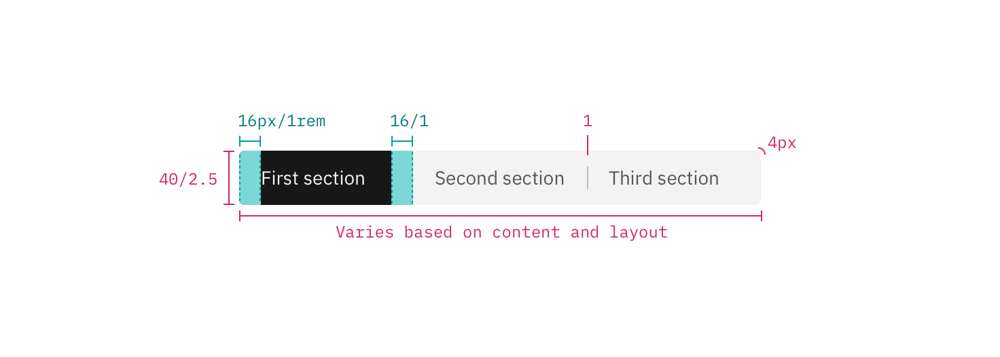

## Color

| Class                                                            | Property                  | SCSS           | HEX     |
| ---------------------------------------------------------------- | ------------------------- | -------------- | ------- |
| `.bx--content-switcher-btn`                                      | border                    | $brand-01      | #3d70b2 |
| `.bx--content-switcher-btn`                                      | color                     | $brand-01      | #3d70b2 |
| `.bx--content-switcher-btn.bx--content-switcher--selected`       | background-color          | $brand-01      | #3d70b2 |
| `.bx--content-switcher-btn.bx--content-switcher--selected`       | color                     | $inverse-01    | #ffffff |
| `.bx--content-switcher-btn.bx--content-switcher--selected:hover` | background & border color | $hover-primary | #30588c |

### States

Content Switchers have two states: selected and non-selected. Selected states are a solid color. There must always be only one selected state, no more, no less. Unselected options have a 1px border with no fill.

## Typography

Content Switcher text should be set in sentence case, with only the first word in a phrase and any proper nouns capitalized. The text should not exceed three words.

| Class                       | Font-size (px/rem) | Font-weight  | Type style |
| --------------------------- | ------------------ | ------------ | ---------- |
| `.bx--content-switcher-btn` | 14 / 0.875         | Normal / 400 | -          |

## Structure

Content Switchers must have at least two options for the user to choose from. Each container that makes up the Content Switcher is equal in size. The width of a container is determined by the length of the longest container option text plus the 32 px / 2rem on both sides of the text.

| Class                                                                             | Property                                | px / rem | Spacing token |
| --------------------------------------------------------------------------------- | --------------------------------------- | -------- | ------------- |
| `.bx--content-switcher`                                                           | height                                  | 40 / 2.5 | -             |
| `.bx--content-switcher-btn:not(:first-of-type)`   `.bx--content-switcher-btn` | border, border-left,   border-right | 1px      | -             |
| `.bx--content-switcher-btn`                                                       | padding-left, padding-right             | 32 / 2   | $spacing-xl   |

    

    
_Structure and spacing measurements for Content Switcher | px / rem_
