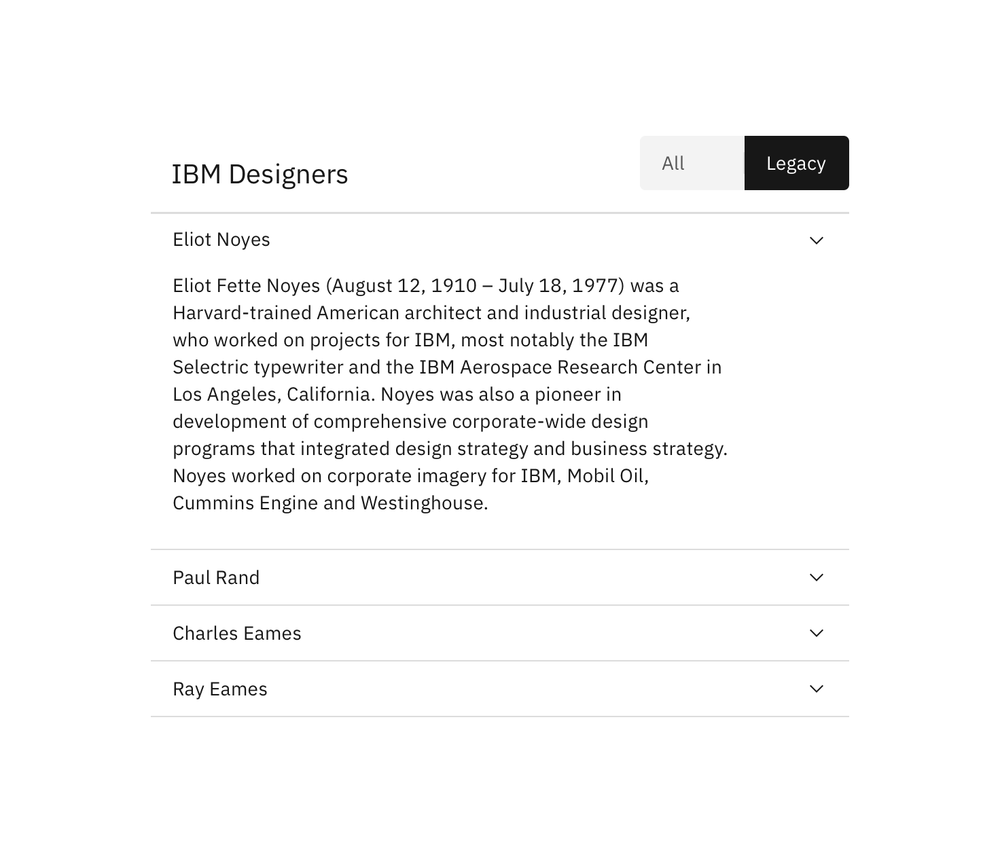

## General guidelines

### Text

Be concise and specific. Titles have a max of two words.

### Default selection

Based on usage, there should be a default selection. The default selection is always the first option in a switcher.

### Example

The content switcher is used for large groups of content, as opposed to the [Toggle](/components/toggle) which is meant for a “Yes/No” or “On/Off” binary decision.

