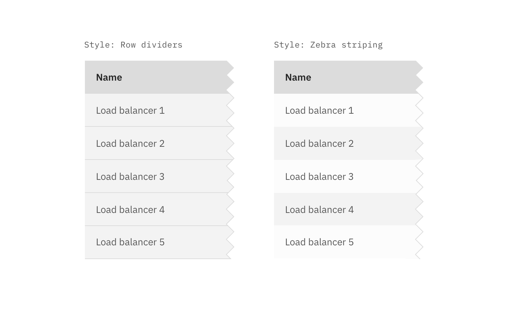

## Color

| Class                                                                                                                 | Property                              | SCSS       | HEX                    |
| --------------------------------------------------------------------------------------------------------------------- | ------------------------------------- | ---------- | ---------------------- |
| `.bx--data-table-v2 tbody`                                                                                            | background-color                      | $ui-01     | #ffffff                |
| `.bx--data-table-v2--zebra tbody tr:nth-child(even)`                                                                  | background-color                      | $ui-02     | #f4f7fb                |
| `.bx--data-table-v2 thead`                                                                                            | background-color                      | $ui-02     | #f4f7fb                |
| `.bx--data-table-v2 tr:hover td`                                                                                      | background-color                      | $hover-row | #5596e6 at 10% opacity |
| `tr.bx--expandable-row-v2 > td:first-of-type:before`                                                                  | background-color                      | $brand-01  | #3d70b2                |
| `.bx--data-table-v2 th:first-of-type`   `.bx--data-table-v2 th:last-of-type`   `.bx--data-table-v2 th`        | border-top, border-right, border-left | $ui-04     | #8897a2                |
| `.bx--data-table-v2 tr:hover td`                                                                                      | border                                | $brand-01  | #3d70b2                |
| `.bx--responsive-table td`   `.bx--responsive-table th`   `.bx--table-sort-v2`   `--data-table-v2-header` | color                                 | $text-01   | #152935                |
| `.bx--table-sort-v2__icon`   `.bx--table-expand-v2__svg`   `.bx--overflow-menu__icon`                         | fill                                  | ui-05      | #5a6872                |

### Style options

Specific styling on the Data Table component can be toggled on/off based on user or team preference.

**Row dividers, Zebra striping, & table border**

If zebra striping is turned off, you must have Row dividers.

_Data Table with various row styling_

 

**Background colors**

Data Tables are built to be accessible against two `$ui-01` and `$ui-02`:

_Data Table on ui-01 vs ui-02_

## Typography

Column headers should be in title case. All other table text should be sentenced case.

| Class                      | Font-size (px/rem) | Font-weight    | Type style        |
| -------------------------- | ------------------ | -------------- | ----------------- |
| `bx--data-table-v2-header` | 18 / 1.125         | Semibold / 600 | `.bx--type-delta` |
| `bx--table-header-label`   | 14 / 0.875         | Semibold / 600 | `.bx--type-zeta`  |
| `.bx--data-table-v2 td`    | 14 / 0.875         | Normal / 400   | -                 |

## Structure

Tables are a configurable and customizable component. Designers can pick and choose certain elements and interactions.

### Row sizes

Short and Default are offered as **user preferences** that can be accessed from the table settings menu.

Compact and Tall are designer and developer preferences. Tall row heights are only recommended if your data is expected to have 2 lines of content in a single row.

| Class                         | Size    | Row Height (px/rem) |
| ----------------------------- | ------- | ------------------- |
| `.bx--data-table-v2--compact` | Compact | 24 / 1.5            |
| `.bx--data-table-v2--short`   | Short   | 32 / 2              |
| `.bx--data-table-v2 tr`       | Default | 48 / 3              |
| `.bx--data-table-v2--tall`    | Tall    | 64 / 4              |

_Data Table: varying row sizes_

### Simple Data Table

The basic table style is the required base from which tables can be developed. Basic tables are composed of a header row followed by rows of data below. At a minimum, tables require three or more columns.

Column widths can vary by content and only requires a minimum spacing between columns.

| Class                       | Property      | px / rem   | Spacing token |
| --------------------------- | ------------- | ---------- | ------------- |
| `.bx--data-table-v2 tr`     | height        | 48 / 3     | -             |
| `.bx--table-expand-v2__svg` | height        | 16 / 1     | -             |
| `.bx--checkbox-appearance`  | height, width | 18 / 1.125 | -             |

### Data table

After the simple table structure, tables can be enhanced by adding any of the following: selectable rows, expanding rows, nested tables, row menus, table batch actions, overall table menu, and/or table filter.

| Class                                                                            | Property                    | px / rem  | Spacing token |
| -------------------------------------------------------------------------------- | --------------------------- | --------- | ------------- |
| `.bx--data-table-v2-header`                                                      | margin-bottom               | 16 / 1    | $spacing-md   |
| `.bx--table-sort-v2__icon`                                                       | padding                     | 2 / 0.125 | $spacing-3xs  |
| `.bx--data-table-v2 td:first-of-type`   `.bx--data-table-v2 td:last-of-type` | padding-left, padding-right | 24 / 1.5  | $spacing-lg   |

  

    

_Structure and spacing measurements for a basic and an enhanced Data Table | px / rem_

### Recommended

| Spacing between | Property | px/rem     | Spacing token |
| --------------- | -------- | ---------- | ------------- |
| Columns         | padding  | ≥ 24 / 1.5 | $spacing-lg   |

### Toolbar

| Class                      | Property                  | px/rem   | Spacing token |
| -------------------------- | ------------------------- | -------- | ------------- |
| `.bx--toolbar-action_icon` | height                    | 16 / 1   | $spacing-md   |
| `.bx--toolbar > div`       | margin-left, margin-right | 4 / 0.25 | $spacing-2xs  |
| `.bx--toolbar`             | margin-top, margin-bottom | 16 / 1   | $spacing-md   |

    

_Structure and spacing measurements for toolbar icons | px / rem_
