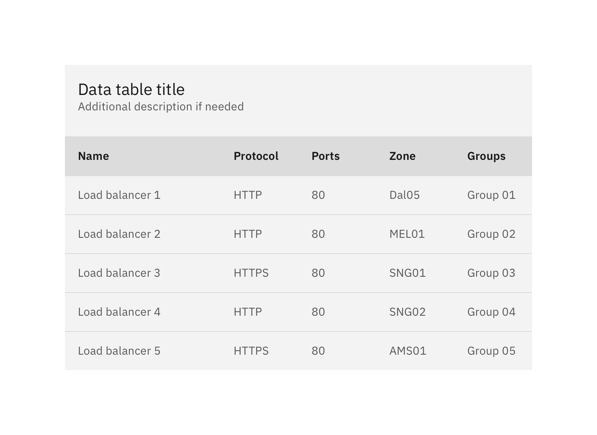
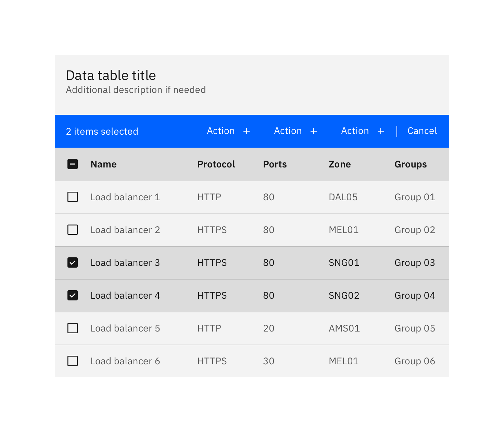
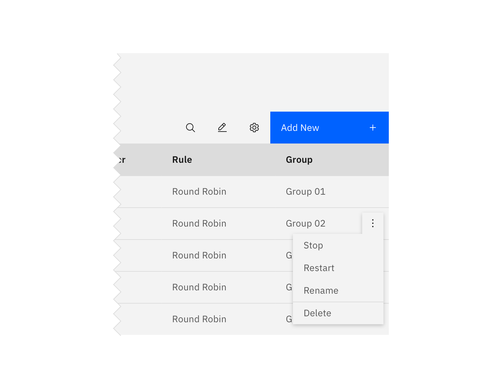

## Basic data table

The data table component is designed in a way for additional functionality to be added on to fit your team's needs.

The basic data table is shipped with a base style, which includes:

- Borders
- No zebra striping, row dividers instead.
- No Pagination, search, table toolbar, or multi-select

<ImageComponent fixed="default" caption="Basic data table">

</ImageComponent>

## Additonal functionality

The following can be added to the data table to increase its functionality.

### Pagination

Pagination divides table data into separate pages. Pagination is accompanied by an option that enables the user to change the number of items per page. See the [pagination](/components/Pagination) component for further guidelines.

<ImageComponent fixed="default" caption="Data table with various Pagination methods">

</ImageComponent>

### Search

Search returns results based on matches. It is used to locate and display a set of results. Search functionality within a table follows [small search](/components/search) conventions. Search should be closed by default, and live below the table title.

<ImageComponent fixed="default" caption="Search on data tables.">

</ImageComponent>

### Sorting

Improve table usability by making data sortable. Clickable headers enable users to sort table data up or down. The specific attribute being sorted is accompanied by a caret icon. The caret will only appear on the column headers once that particular column is being sorted. You can see a demo of this on Carbon's [Codepen.](https://codepen.io/tjegan/pen/PjjyVN)

### Table toolbar

The table toolbar is reserved for global table actions such as table settings, complex filter, export, or editing table data. Additional options can be added if you have an icon to support that function. Icons should be 16x16 px (glyphs). We recommend using no more than 5 icons within the table toolbar.

<ImageComponent fixed="default" caption="Table toolbar: table settings">

</ImageComponent>

### Multi-select / batch action

Batch actions are functions that may be performed on multiple items within a table. Once the user selects at least one row from the table, the **batch action bar** appears at the top of the table, presenting the user with actions they can take. To exit or escape "batch action mode," the user can cancel out or deselect the items.

<ImageComponent fixed="default" caption="Batch action mode on data tables">

</ImageComponent>

### Inline actions

Inline actions are functions that may be performed on a specific table item. Each row is accompanied by an [overflow menu](/components/overflow-menu) that contains actions related specifically to that table row.

<ImageComponent fixed="default" caption="Inline actions on data tables">

</ImageComponent>
