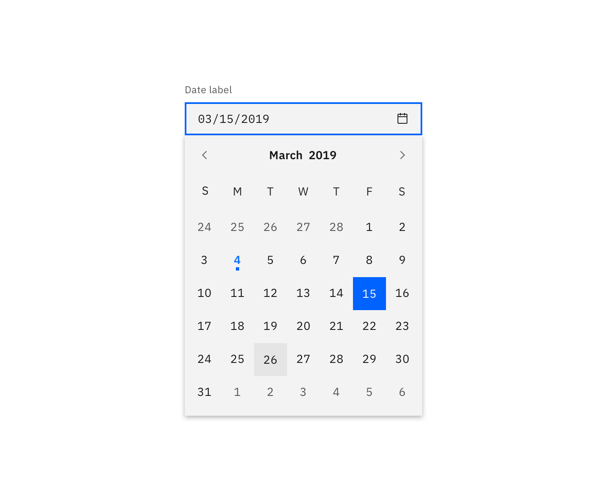
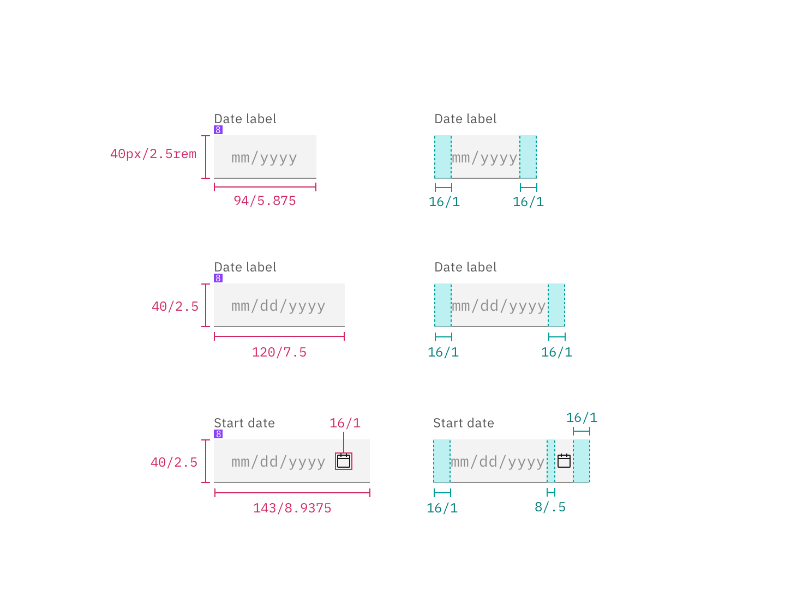
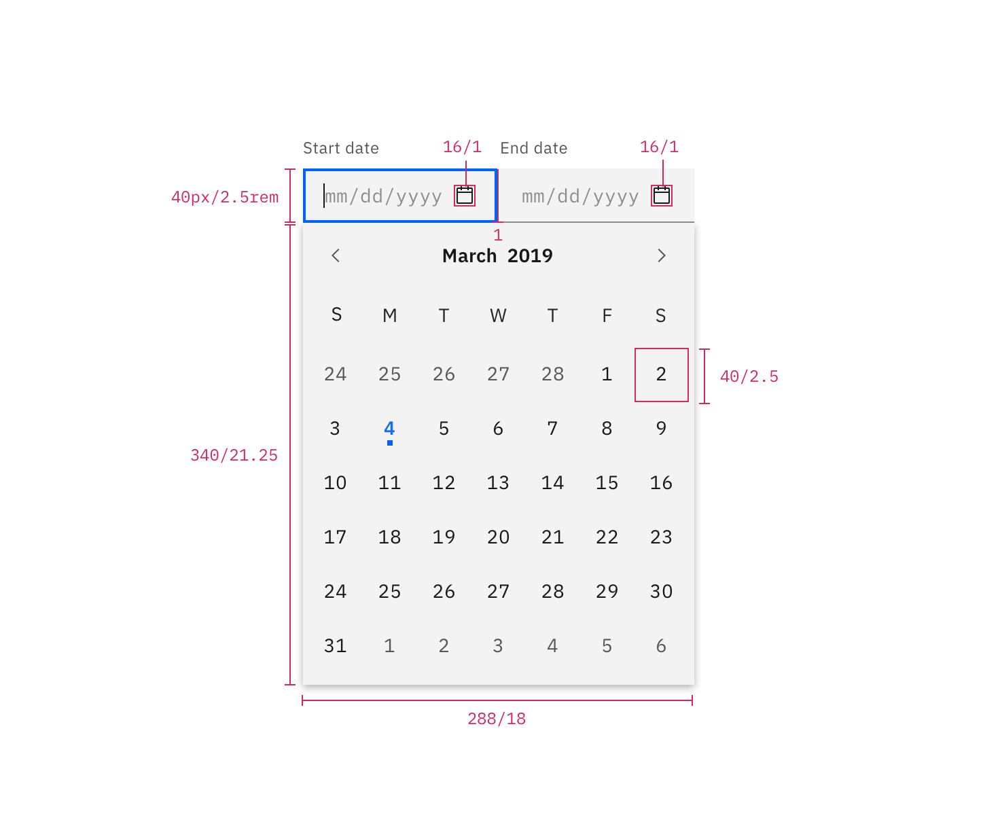
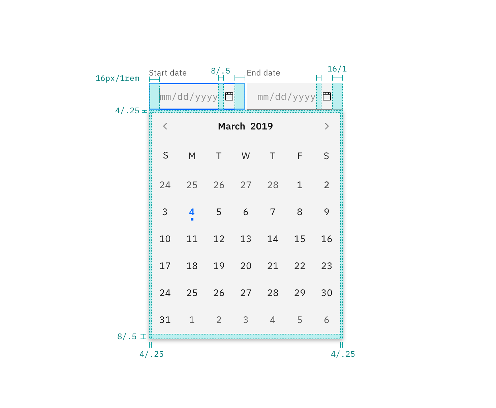
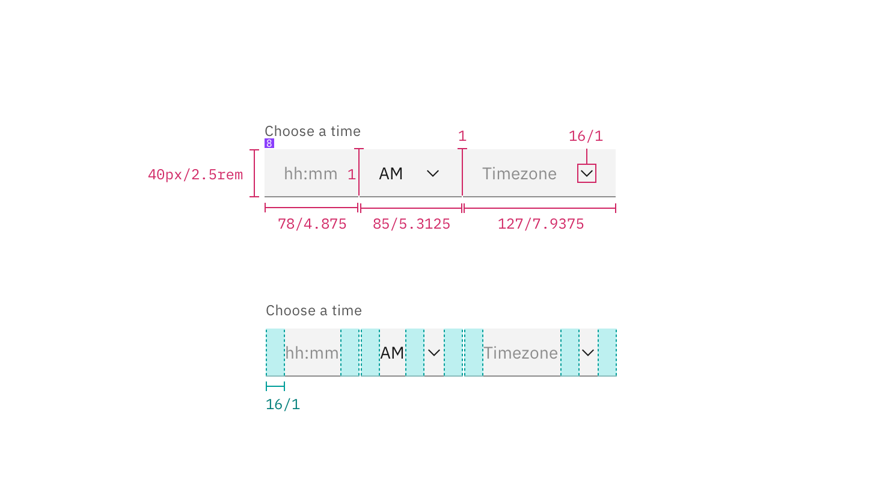

## Color

Inputs come in two different colors. The default input color is `$field-01` and is used on `$ui-01` page backgrounds. The light version input color is `$field-02` and is used on `$ui-02` page backgrounds.

If a `min date` is set on the calendar, then any text appearing before that date will be `#152935 @ 50%`, otherwise all text should be `#152935` (unless the number is selected or highlighted). Please refer to [Select](/components/select), for inline select styling.

| Class                                           | Property         | SCSS      | HEX     |
| ----------------------------------------------- | ---------------- | --------- | ------- |
| `.bx--date-picker__input`                       | background-color | $field-01 | #f4f7fb |
| `.bx--date-picker__input`                       | border-bottom    | $ui-05    | #5a6872 |
| `.bx--date-picker__input`                       | color            | $text-01  | #152935 |
| `.bx--date-picker__input::placeholder`          | color            | $text-02  | #5a6872 |
| `.bx--date-picker__input.bx--text-input--light` | background-color | $field-02 | #ffffff |
| `.bx--label`                                    | color            | $text-01  | #152935 |
| `.bx--date-picker__calendar`                    | background-color | $ui-01    | #ffffff |
| `.bx--date-picker__day.selected`                | border           | $text-01  | #152935 |
| `.bx--date-picker__day.inRange`                 | background-color | $ui-02    | #f4f7fb |
| `.bx--date-picker__icon`                        | fill             | $brand-01 | #3d70b2 |
| `.bx--date-picker__day.today::after`            | background-color | $brand-01 | #3d70b2 |
| `.bx--date-picker__day.selected`                | border           | $brand-01 | #3d70b2 |
| `.bx--date-picker__day.inRange`                 | background-color | $text-01  | #152935 |

_Date Picker example using both $field-02 (top) and $field-01 (bottom)_

### States

| Class                                                      | Property      | SCSS        | HEX     |
| ---------------------------------------------------------- | ------------- | ----------- | ------- |
| `.bx--date-picker__input:focus`                            | border-bottom | $brand-01   | #3d70b2 |
| `.bx--date-picker__input[data-invalid]`                    | box-shadow    | $support-01 | #e0182d |
| `.bx--form-requirement`                                    | color         | $support-01 | #e0182d |
| `.bx--date-picker__input:focus ~ .bx--label`               | color         | $brand-01   | #3d70b2 |
| `.bx--date-picker__input[data-invalid]:focus + .bx--label` | border-bottom | $support-01 | #e0182d |

**Active:** Placeholder text should remain when the user clicks into the text input and gets a cursor. Once the user starts typing the hint text is replaced with the user input text.

**Error:** Error messages appear below the input field and are always present while invalid.

**Disabled:** Disabled state appears at 50% opacity and has a `.not-allowed` cursor on hover.

## Typography

Labels should be set in sentence case, with only the first word in a phrase and any proper nouns capitalized, and no more than three words.

| Class                                       | Font-size  | Font-weight     | Type style          |
| ------------------------------------------- | ---------- | --------------- | ------------------- |
| `.bx--label`                                | 14 / 0.875 | Semi-Bold / 600 | `.bx--type-zeta`    |
| `.bx--time-picker__input-field:placeholder` | 14 / 0.875 | Semi-Bold / 600 | `.bx--type-zeta`    |
| `.bx--time-picker__input-field` active      | 14 / 0.875 | Semi-Bold / 600 | `.bx--type-zeta`    |
| `.bx--form-requirement`                     | 12 / 0.75  | Normal / 400    | `.bx--type-caption` |

## Layer

| Class                        | Layer, Elevation | Box-shadow                       |
| ---------------------------- | ---------------- | -------------------------------- |
| `.bx--date-picker__calendar` | Pop-out, 24      | 0 12px 24px 0 rgba(0, 0, 0, 0.1) |

## Structure

### Simple & Single Date Pickers

| Class                                              | Property                    | px / rem    | Spacing token |
| -------------------------------------------------- | --------------------------- | ----------- | ------------- |
| `.bx--date-picker__input`                          | height                      | 40 / 2.5    | -             |
| `.bx--date-picker--short .bx--date-picker__input`  | width                       | 91 / 5.7    | -             |
| `.bx--date-picker--simple .bx--date-picker__input` | width                       | 114 / 7.125 | -             |
| `.bx--date-picker--single .bx--date-picker__input` | width                       | 144 / 9     | -             |
| `.bx--date-picker__icon`                           | height & width              | 16 / 1      | -             |
| `.bx--date-picker__calendar`                       | padding-right, padding-left | 16 / 1      | $spacing-md   |
| `.bx--date-picker__input`                          | box-shadow                  | 1px         | -             |
| `.bx--date-picker__input:focus`                    | box-shadow                  | 2px         | -             |
| `.bx--date-picker__icon + .bx--date-picker__input` | padding-left                | 48 / 3      | $spacing-3xl  |

  

    
  

  

    
  

  

    
  

  

    
  

_Structure and spacing for Simple & Single Date Pickers | px / rem_

### Range Date Picker

| Class                                                              | Property                                 | px / rem     | Spacing token |
| ------------------------------------------------------------------ | ---------------------------------------- | ------------ | ------------- |
| `.bx--date-picker__input`                                          | height                                   | 230 / 14.375 | -             |
| `.bx--date-picker--range .bx--date-picker__input`                  | width                                    | 280 / 17.5   | -             |
| `.bx--date-picker__icon`                                           | height, width                            | 16 / 1       | -             |
| `.bx--date-picker__day.today::after`                               | height & width                           | 3px          | -             |
| `.bx--date-picker--range > .bx--date-picker-container:first-child` | margin-right                             | 8 / 0.5      | $spacing-xs   |
| `.bx--date-picker__input`                                          | padding-right, padding-left, padding-top | 16 / 1       | $spacing-md   |
| `.bx--date-picker__input`                                          | padding-bottom                           | 4 / .25      | $spacing-2xs  |

_Structure for Date Picker | px / rem_

_Spacing for Date Picker | px / rem_

### Time Picker

There are two types of time pickers; a 12-hour and 24-hour time picker. The 12-hour Time Picker is accompanied by a time period (am/pm) input, while the 24-hour clock is not.

| Class                           | Property                    | px / rem | Spacing token |
| ------------------------------- | --------------------------- | -------- | ------------- |
| `.bx--time-picker__input-field` | height                      | 40 / 2.5 | -             |
| `.bx--time-picker__input-field` | width                       | 80 / 5   | -             |
| `.bx--time-picker__input-field` | padding-right, padding-left | 16 / 1   | $spacing-md   |
| `.bx--select-input`             | padding-left                | 16 / 1   | $spacing-md   |

  

    
  

  

    
  

_Structure and spacing for a Time Picker | px / rem_
