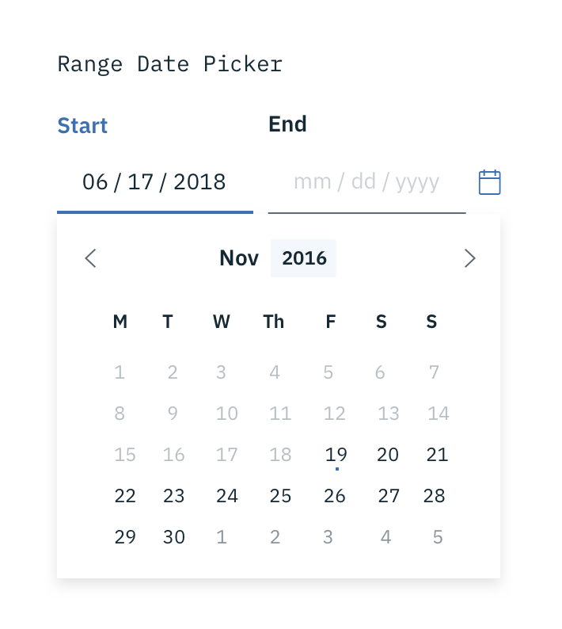

## Usage

| Type               | Purpose                                                                                     |
| ------------------ | ------------------------------------------------------------------------------------------- |
| Range Date Picker  | To select a range of dates, accompanied by a calendar widget.                               |
| Single Date Picker | When a user needs to select one date, accompanied by a calendar widget.                     |
| Simple Date Picker | When the date is known by the user, and they don't need a calendar to anticipate the dates. |

  

    
  

  

    
  

  

    
  

_Types of Date Pickers_

## General guidelines

### Labels

Both Date and Time Pickers are accompanied by labels, and follow the same accessibility guidelines for all [Forms](/components/form).

### Format

For Date Pickers, use placeholder text so users input the date in the correct format. It can be formatted in a variety of ways. See the Date Picker code [documentation](https://github.com/ibm/carbon-components/tree/master/src/components/date-picker) for more info.

## Interaction

### Calendar widget

It is recommended to use the Date Picker with a calendar widget when the user is browsing between a range of dates. We can aid the user in making the proper choices by providing a visual reference of dates for them to choose from. The calendar widget appears once the user has interacted with the date input field (typically on `:focus`).

_Selecting dates from the Range Date Picker_

### Simple Date Picker

The Simple Date Picker provides the user with a text input in which they can input month/day/year. Simple Date Pickers are typically used when the date is known by the user, such as a birthday or credit card expiration.

## Time Picker

Time pickers provide the user with a text input in which they can input hours/minutes. Additionally, they can be accompanied by an “AM/PM” selection and a time zone selection, which is styled as an [Inline Select](/components/select).

    

_Time picker used to set deployment time_
