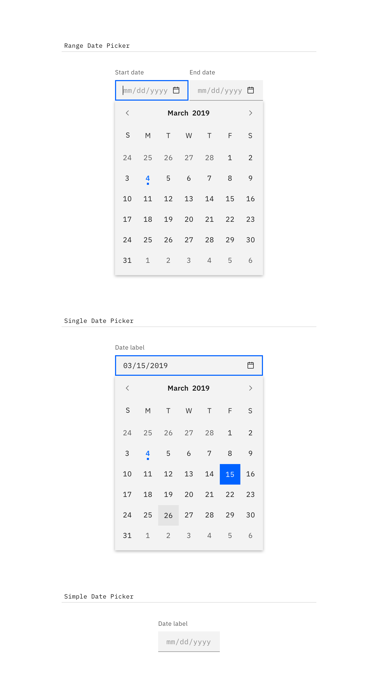

<anchor-links>
<ul>
    <li><a data-scroll href="#general-guidance">General guidance</a></li>
    <li><a data-scroll href="#variations">Variations</a></li>
    <li><a data-scroll href="#content">Content</a></li>
    <li><a data-scroll href="#interaction">Interaction</a></li>
    <li><a data-scroll href="#time-picker">Time picker</a></li>
</ul>
</anchor-links>

## General guidance

_Date and time pickers_ allow users to select a single or a range of dates and times.

## Variations

| Type               | Purpose                                                                                     |
| ------------------ | ------------------------------------------------------------------------------------------- |
| _Range Date Picker_  | To select a range of dates, accompanied by a calendar widget.                               |
| _Single Date Picker_ | When a user needs to select one date, accompanied by a calendar widget.                     |
| _Simple Date Picker_ | When the date is known by the user, and they don't need a calendar to anticipate the dates. |

<image-component cols="8" caption="Types of date pickers">

</image-component>

## Content

#### Labels
Both Date and Time Pickers are accompanied by labels, and follow the same accessibility guidelines for all [Forms](/components/form).

#### Format
For Date Pickers, use placeholder text so users input the date in the correct format. It can be formatted in a variety of ways. See the Date Picker code [documentation](https://github.com/ibm/carbon-components/tree/master/src/components/date-picker) for more info.

## Interaction

#### Calendar widget

It is recommended to use the Date Picker with a calendar widget when the user is browsing between a range of dates. We can aid the user in making the proper choices by providing a visual reference of dates for them to choose from. The calendar widget appears once the user has interacted with the date input field (typically on `:focus`).

<image-component cols="8" caption="Selecting dates from the range date picker">

</image-component>

#### Simple Date Picker

The Simple Date Picker provides the user with a text input in which they can input month/day/year. Simple Date Pickers are typically used when the date is known by the user, such as a birthday or credit card expiration.

## Time picker

Time pickers provide the user with a text input in which they can input hours/minutes. Additionally, they can be accompanied by an “AM/PM” selection and a time zone selection, which is styled as an [Inline Select](/components/select).
