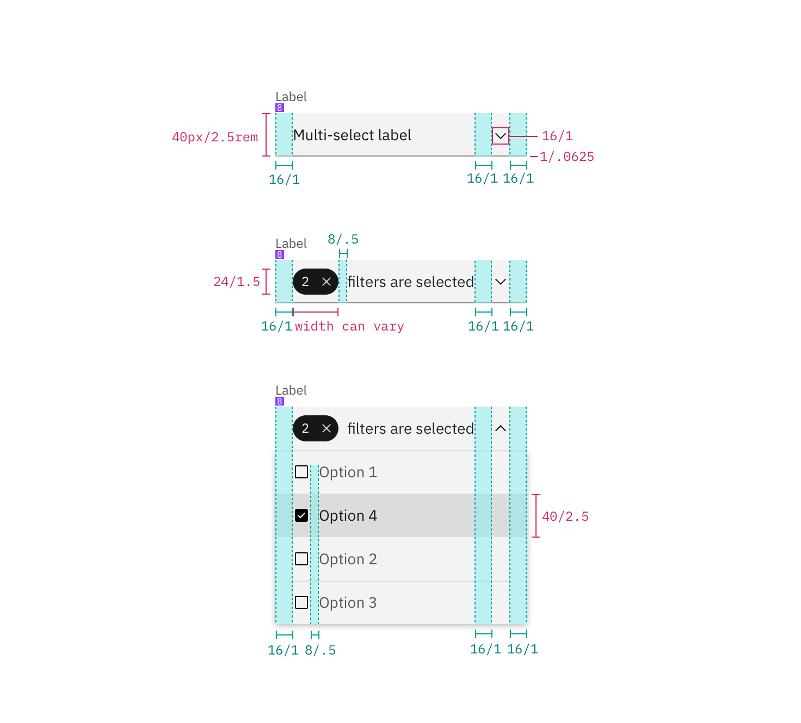
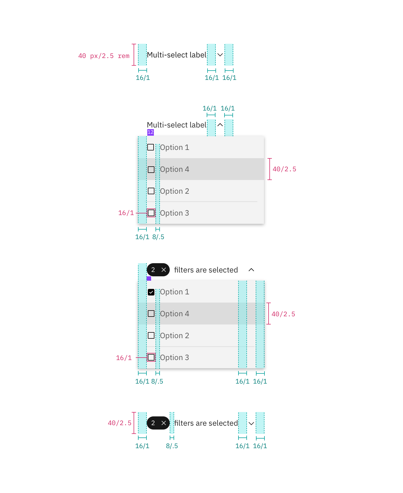
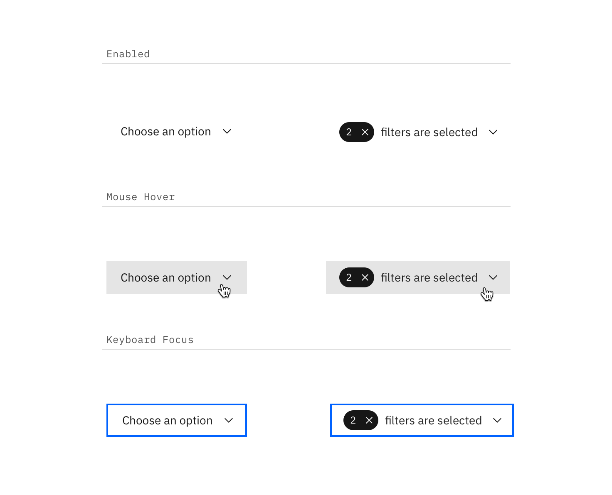

## Color

Inputs come in two different colors. The default input color is `$field-01` and is used on `$ui-01` page backgrounds. The light version input color is `$field-02` and is used on `$ui-02` page backgrounds.

| Class                                                               | Property         | SCSS       | HEX                    |
| ------------------------------------------------------------------- | ---------------- | ---------- | ---------------------- |
| `.bx--dropdown`                                                     | background-color | $field-01  | #f4f7fb                |
| `.bx--dropdown`   `bx--multi-select bx--combo-box bx--list-box` | box-shadow       | $ui-05     | #5a6872                |
| `.bx--dropdown--light`                                              | background-color | $field-02  | #ffffff                |
| `.bx--dropdown-list`                                                | background-color | $ui-01     | #ffffff                |
| `.bx--dropdown-text`                                                | color            | $text-01   | #152935                |
| `.bx--dropdown-text::placeholder`                                   | color            | $text-03   | #cdd1d4                |
| `.bx--dropdown-link:hover`   `.bx--dropdown-link:focus`         | background-color | $hover-row | #5596e6 at 10% opacity |
| `.bx--dropdown__arrow`                                              | fill             | $brand-01  | #3d70b2                |
| `.bx--list-box__selection--multi`                                   | background-color | $brand-01  | #3d70b2                |

_Example of Dropdowns with $field-02 (left) and $field-01 (right)_

### States

| Class                                                          | Property   | SCSS        | HEX     |
| -------------------------------------------------------------- | ---------- | ----------- | ------- |
| `.bx--form-requirement`                                        | color      | $support-01 | #e0182d |
| `.bx--dropdown--open:focus`   `.bx--list-box__field:focus` | box-shadow | $brand-01   | #3d70b2 |
| `.bx--select-input[data-invalid]`                              | box-shadow | $support-01 | #e0182d |

**Active:** Placeholder text should remain when the user clicks into the text input and gets a cursor. Once the user starts typing the hint text is replaced with the user input text.s

**Help text:** Help text appears below the label when the input is active. Help text remains visible while the input is focused and disappears after focus away.

**Error:** Error messages appear below the input field and are always present while invalid.

**Disabled:** Disabled state appears at 50% opacity and has a `.not-allowed` cursor on hover.

## Typography

All Dropdown text should be set in sentence case, with only the first word in a phrase and any proper nouns capitalized. Dropdown options should not exceed three words.

| Class                   | Font-size  | Font-weight     | Type style          |
| ----------------------- | ---------- | --------------- | ------------------- |
| `.bx--dropdown-text`    | 14 / 0.875 | Semi-bold / 600 | `.bx--type-zeta`    |
| `.bx--dropdown-link`    | 14 / 0.875 | Normal / 400    | -                   |
| `.bx--list-box__label`  | 14 / 0.875 | Semi-bold / 600 | `.bx--type-zeta`    |
| `.bx--form-requirement` | 12 / 0.75  | Normal / 400    | `.bx--type-caption` |

## Layer

| Class                                                  | Layer, Elevation | Box-shadow                      |
| ------------------------------------------------------ | ---------------- | ------------------------------- |
| `.bx--dropdown--open:focus`   `.bx--dropdown-list` | Overlay, 8       | `0 4px 8px 0 rgba(0,0,0,0.10);` |

## Structure

Dropdowns have two states, open and closed. An open and closed Dropdown should be the same width and appropriately fit the design, layout, and content. The height of a closed Dropdown stays consistent while the height of an open Dropdown will vary based on the amount of options it has. Please note the various color differences for closed and open Dropdowns.

| Class                 | Property                    | px / rem    | Spacing tokens |
| --------------------- | --------------------------- | ----------- | -------------- |
| `.bx--dropdown`       | height                      | 40 / 2.5    | -              |
| `.bx--dropdown-text`  | padding-left                | 16 / 1      | $spacing-md    |
| `.bx--dropdown-text`  | padding-right               | 40 / 2.5    | $spacing-2xl   |
| `.bx--dropdown-text`  | padding-top, padding-bottom | 13 / 0.8125 | -              |
| `.bx--dropdown`       | box-shadow                  | 1px         | -              |
| `.bx--dropdown:focus` | box-shadow                  | 2px         | -              |

_Structure and spacing measurements for Dropdown | px / rem_

_Normal, active, open, and disabled states for Dropdown_

## Multi-Select Dropdown

| Class                             | Property                    | px / rem   | Spacing tokens |
| --------------------------------- | --------------------------- | ---------- | -------------- |
| `.bx--list-box__menu-item`        | height                      | 40 / 2.5   | -              |
| `.bx--list-box__field`            | padding-left, padding-right | 16 / 1     | $spacing-md    |
| `.bx--checkbox-label`             | padding-left                | 4 / 0.25   | $spacing-2xs   |
| `.bx--list-box__menu-icon`        | padding-left, padding-right | 16 / 1     | $spacing-md    |
| `.bx--list-box__selection--multi` | height                      | 18 / 1.125 | -              |
| `.bx--list-box__selection--multi` | margin-right                | 10 / 0.625 | -              |

_Structure and spacing measurements for a Multi-Select Dropdown | px / rem_

## Inline Dropdown

| Class                                | Property                    | px / rem   | Spacing token |
| ------------------------------------ | --------------------------- | ---------- | ------------- |
| `.bx--list-box.bx--list-box--inline` | height                      | 32 / 2     | -             |
| `.bx--list-box__menu-item`           | height                      | 40 / 2.5   | -             |
| `.bx--list-box__menu-item`           | padding-right, padding-left | 16 / 1     | $spacing-md   |
| `.bx--checkbox-label`                | padding-left                | 4 / 0.25   | $spacing-2xs  |
| `.bx--list-box__menu-icon`           | padding-right               | 12 / 0.75  | $spacing-sm   |
| `.bx--list-box__menu-icon`           | padding-right               | 10 / 0.625 | -             |
| `.bx--checkbox-label::before`        | height                      | 18 / 1.125 | -             |

_Structure and spacing for Inline Dropdown | px / rem_

### Inline Dropdown states

Inline select has two different states, one for mouse hover and one for keyboard focus.

    

_Hover and focus states for Inline Dropdown_

## Filtering

Filtering can be used with Dropdown and Multi-select Dropdown but not Inline Dropdown.

| Class                             | Property                    | px / rem   | Spacing token |
| --------------------------------- | --------------------------- | ---------- | ------------- |
| `.bx--list-box__selection`        | height                      | 40 / 2.5   | -             |
| `.bx--list-box__selection svg`    | height                      | 10 / 0.625 | -             |
| `.bx--list-box__menu-icon`        | padding-left, padding-right | 16 / 1     | $spacing-md   |
| `.bx--list-box__selection`        | padding-left, padding-right | 16 / 1     | $spacing-md   |
| `.bx--list-box__selection--multi` | height                      | 18 / 1.125 | -             |

_Spacing for Multi-select Dropdown with Filtering | px / rem_

_Interaction states for Multi-select Dropdown with Filtering | px / rem_
