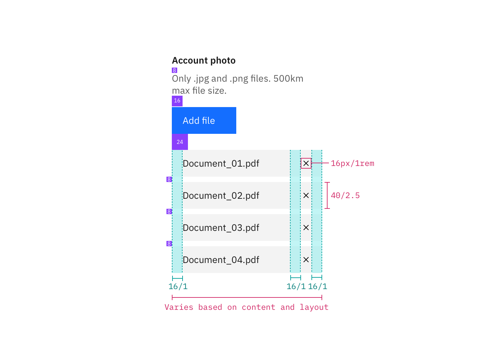

## Color

| Class                      | Property   | SCSS        | HEX     |
| -------------------------- | ---------- | ----------- | ------- |
| `.bx--label`               | color      | $text-01    | #152935 |
| `.bx--label-description`   | color      | $text-02    | #5a6872 |
| `.bx--file-filename`       | color      | $text-01    | #152935 |
| `.bx--file__selected-file` | background | $ui-01      | #ffffff |
| `.bx--file-close`          | fill       | $inverse-01 | #152935 |

## Typography

The File Uploader label and instruction text should be set in sentence case, with only the first letter of the first word in the sentence capitalized.

| Class                    | Font-size (px/rem) | Font-weight     | Type style          |
| ------------------------ | ------------------ | --------------- | ------------------- |
| `.bx--label`             | 14 / 0.875         | Semi-Bold / 600 | `.bx--type-zeta`    |
| `.bx--label-description` | 14 / 0.875         | Normal / 400    | -                   |
| `.bx--file-filename`     | 12 / 0.75          | Normal / 400    | `.bx--type-caption` |

## Structure

The width of an uploaded file varies based on the content and layout of a design. Refer to the [Button](/components/button) guidelines for styling and usage of the “Add files” button.

| Class                      | Property                    | px / rem   | Spacing token |
| -------------------------- | --------------------------- | ---------- | ------------- |
| `.bx--file-filename`       | height                      | 30 / 1.875 | -             |
| `.bx--file__selected-file` | padding-left, padding-right | 16 /1      | $spacing-md   |
| `.bx--file__selected-file` | margin-bottom               | 16 /1      | $spacing-md   |

    

_Structure and spacing measurements for File Uploader | px / rem_

### Recommended

The following specs are not built into the File Uploader component but are recommended by design as the proper amount between File Uploader elements.

| Class             | Property                  | px / rem | Spacing token |
| ----------------- | ------------------------- | -------- | ------------- |
| `.bx--file-close` | height, width             | 16 / 1   | -             |
| `.bx--file-close` | margin-left, margin-right | 16 / 1   | $spacing-md   |

    

_Recommended structure and spacing measurements for File Uploader | px / rem_
