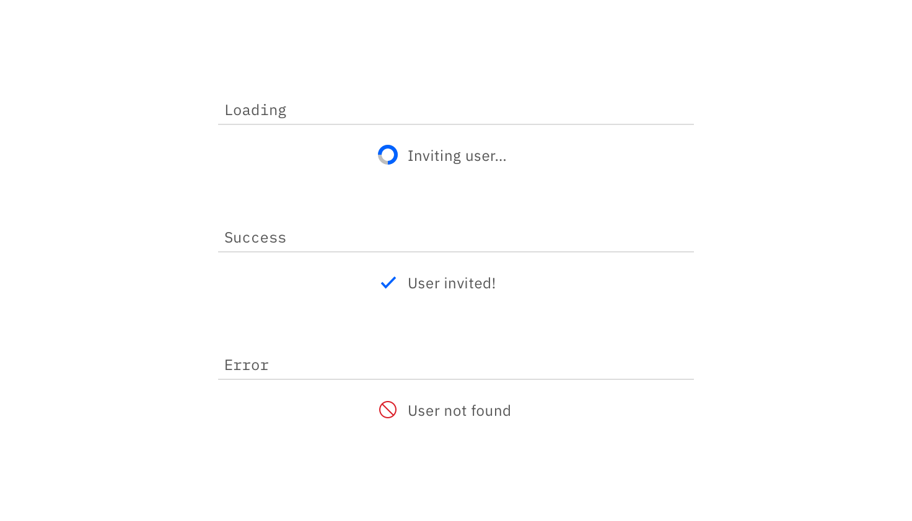

## Color

| Class                           | Property   |SCSS        | HEX     |
|---------------------------------|------------|------------|---------|
| `.bx--loading__svg`             | stroke     | $ui-05     | #152935 |
| `.bx--inline-loading__checkmark`| stroke     | $ui-05     | #5a6872 |
| `.bx--inline-loading__text`     | color      | $text-01   | #152935 |

## Structure

| Property             | px | rem  |
|----------------------|----|------|
| Spinner        | 16 | 1    |
| Checkmark      | 16 | 1 |

| Class                           | Property     |px / rem    |
|---------------------------------|--------------|------------|
| `.bx--inline-loading__animation`| width, height| 16 / 2     |

  

    
  

  

    
  

_Structure measurements for small and large loading spinner | px / rem_

## Typography

Button text should be set in sentence case, with only the first word in a phrase and any proper nouns capitalized.

| Class                     | Font-size (px/rem) | Font-weight     | Type style       |
|---------------------------|--------------------|-----------------|------------------|
|`.bx--inline-loading__text`| 14 / 0.875         | Regular / 400   | `.bx--type-zeta` |

### Placement

The Inline Loading component should appear during any user action loading. If button is used to trigger the action, the Inline Loading component should replace that button.

_

_

_Example of a inline loading in product context_
