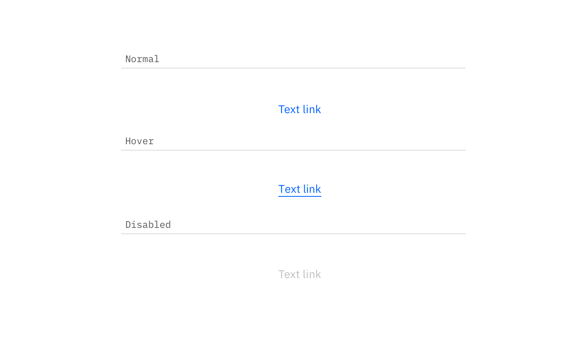

## Color

| Class     | Property | SCSS    | HEX           |
|-----------|----------|---------|---------------|
|`.bx--link`| color    |$brand-01| #3d70b2       |

### States

| Class                            | Property | SCSS                | HEX           |
|----------------------------------|----------|---------------------|---------------|
| `.bx--link:hover`                | color    | $hover-primary-text | #294c86       |
| `.bx--link[aria-disabled='true']`| color    | $brand-01           | #3d70b2 @ 50% |

---
***
> 

_Normal, hover disabled Link states_

## Typography

Link text should be set in set in sentence case with the first letter of each word capitalized. Links should not exceed three words.

| Property    | Font-size (px/rem) | Font-weight    | Text style       |
|-------------|--------------------|----------------|------------------|
| `.bx--link` | 14 / 0.875         | Semi-Bold / 600| `.bx--type-zeta` |

## Structure

### Recommended

Links can be grouped horizontally or vertically and must be underlined. The following specs are not built into the Link component but are recommended by design as the proper distance between grouped Links.

| Class     | Property      | px / rem  | Spacing token |
|-----------|---------------|-----------|---------------|
|`.bx--link`| line-height   | 24 / 1.5  | - |
|`.bx--link`| padding-right | 16 / 1    | $spacing-md   |

---
***
> 

_Structure and spacing measurements for Link | px / rem_
