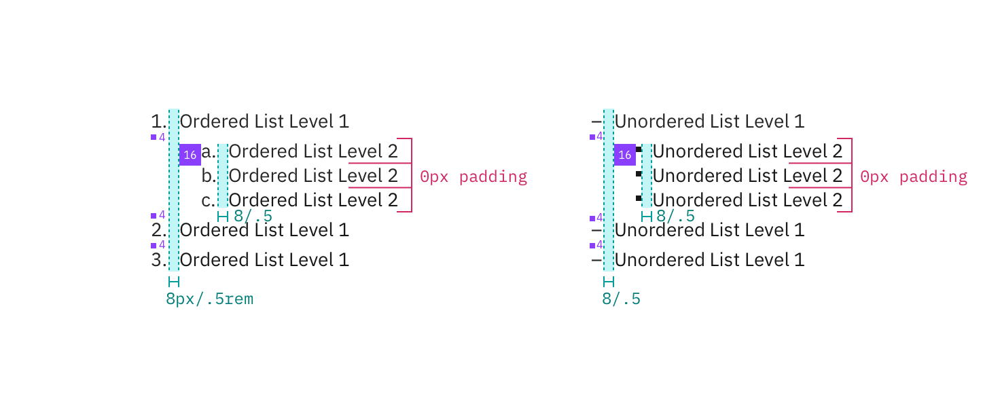

## Color

| Attribute         | Property | SCSS     | HEX     |
| ----------------- | -------- | -------- | ------- |
| `.bx--list__item` | color    | $text-01 | #152935 |

## Typography

Level 1 and 2 of any list type should be set in bold and sentence case, with only the first word in a phrase and any proper noun capitalized. **Line height** for lists should be set at 24px / 1.5rem.

| Class                                 | Font-size (px/rem) | Font-weight     | Text style       |
| ------------------------------------- | ------------------ | --------------- | ---------------- |
| `.bx--list__item`                     | 14 / 0.875         | Semi-Bold / 600 | `.bx--type-zeta` |
| `.bx--list--nested > .bx--list__item` | 14 / 0.875         | Normal / 400    | -                |

## Structure

There are two types of Lists, ordered and unordered.
Level 1 ordered list points are marked numerically while Level 2 points are marked with a dash.
Level 1 unordered list points are bulleted while Level 2 points are marked with a dash.

| Class                                             | Property    | px / rem | Spacing token |
| ------------------------------------------------- | ----------- | -------- | ------------- |
| `.bx--list--unordered`   `.bx--list--ordered` | padding     | 16 / 1   | $spacing-md   |
| `.bx--list--ordered`                              | line-height | 24/1.5   | -             |

  

    
  

  

    
  

_Structure and spacing measurements for an ordered and an unordered List | px / rem_
