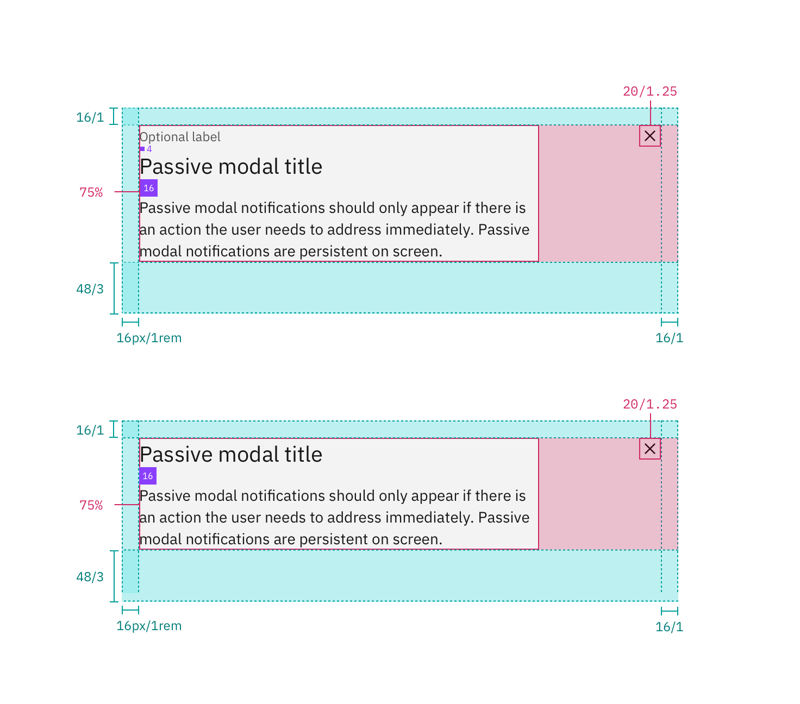
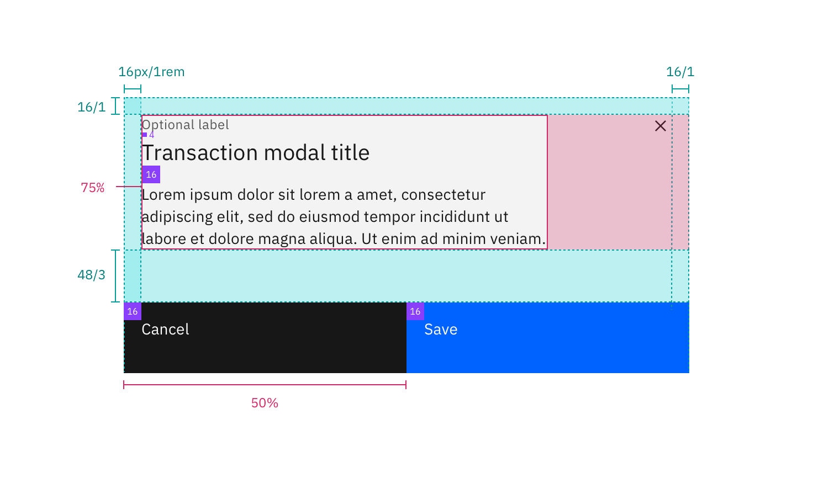
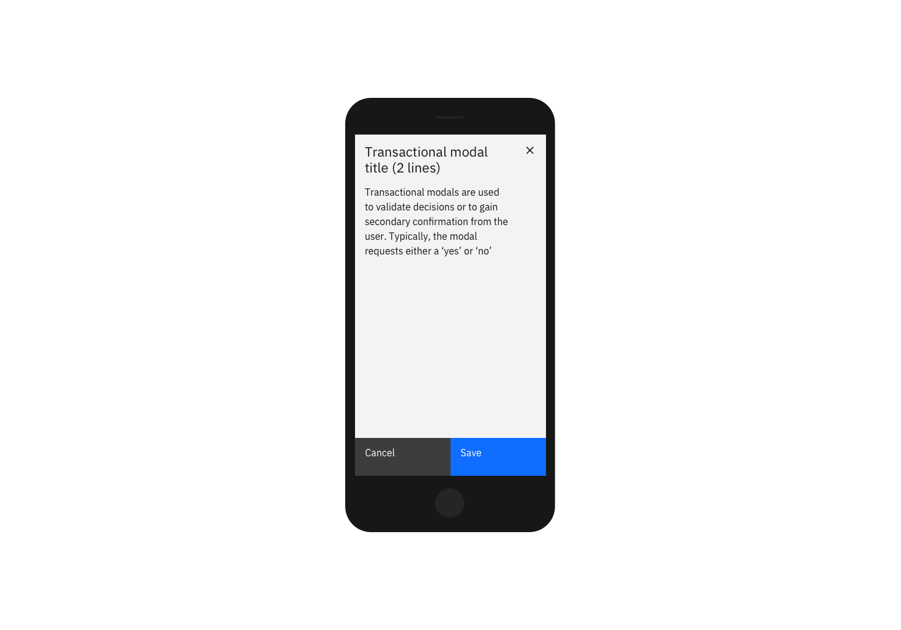

## Color

| Class                        | Property         | SCSS      | HEX                   |
| ---------------------------- | ---------------- | --------- | --------------------- |
| `.bx--modal-container`       | background-color | $ui-01    | #ffffff               |
| `.bx--modal-container`       | border-top       | $brand-01 | #3d70b2               |
| `.bx--modal-header__label`   | color            | $text-01  | #152935               |
| `.bx--modal-header__heading` | color            | $text-02  | #5a6872               |
| `.bx--modal-content`         | color            | $text-01  | #152935               |
| `.bx--modal-close__icon`     | fill             | $ui-05    | #5a6872               |
| `.bx--modal-footer`          | background-color | $ui-05    | #5a6872               |
| `.bx--modal`                 | background-color | $ui-03    | #dfe3e6 @ 50% opacity |

## Typography

Modal labels are optional and should be set in all caps when used. Modal titles should be set in sentence case and should not exceed three words. Important directions or information in the Modal text can be bold, otherwise it should be in roman.

| Class                        | Font-size (px/rem) | Font-weight     | Type style       |
| ---------------------------- | ------------------ | --------------- | ---------------- |
| `.bx--modal-header__label`   | 14 / 0.875         | Semi-Bold / 600 | `.bx--type-zeta` |
| `.bx--modal-header__heading` | 28 / 1.75          | Light / 300     | `.bx--type-beta` |
| `.bx--modal-content`         | 16 / 1             | Normal / 400    | p                |

## Layer

| Class                  | Layer, Elevation | Box-shadow                      |
| ---------------------- | ---------------- | ------------------------------- |
| `.bx--modal-container` | Pop-out , 24     | 0 12px 24px 0 rgba(0,0,0,0.10); |

## Structure

| Class                                      | Property                    | px / rem   | Spacing token |
| ------------------------------------------ | --------------------------- | ---------- | ------------- |
| `.bx--modal-container`                     | border-top                  | 4 / 0.25   | -             |
| `.bx--modal-close__icon`                   | height, width               | 10 / 0.625 | -             |
| `.bx--modal-container`                     | padding-left, padding-right | 48 / 3     | $spacing-3xl  |
| `.bx--modal-container`                     | padding-top                 | 40 / 2.5   | $spacing-2xl  |
| `.bx--modal-header__label .bx--type-delta` | margin-bottom               | 8 / 0.5    | $spacing-xs   |
| `.bx--modal-header`                        | margin-bottom               | 24 / 1.5   | $spacing-lg   |
| `.bx--modal-content`                       | margin-bottom               | 48 / 3     | $spacing-3xl  |
| `.bx--modal-footer`                        | padding-top, padding-bottom | 32 / 2     | $spacing-xl   |
| `.bx--modal-footer`                        | padding-left, padding-right | 48 / 3     | $spacing-3xl  |
| `.bx--btn--secondary + .bx--btn--primary,` | margin-left                 | 16 / 1     | $spacing-md   |

_Structure and spacing measurements for a Passive Modal | px / rem_

_Structure and spacing measurements for a Transactional Modal | px / rem_

## Mobile

Modals should be full screen on mobile.

    

_Example of a Modal on a mobile screen_
