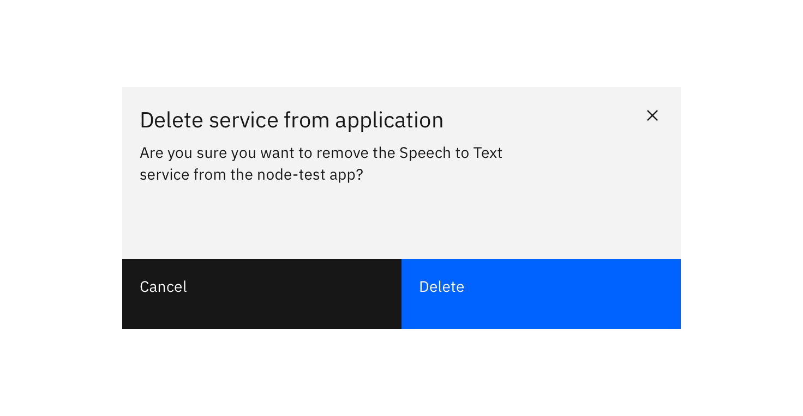
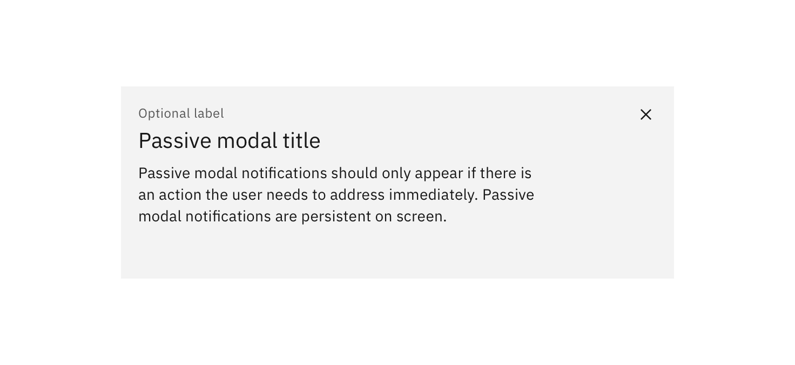
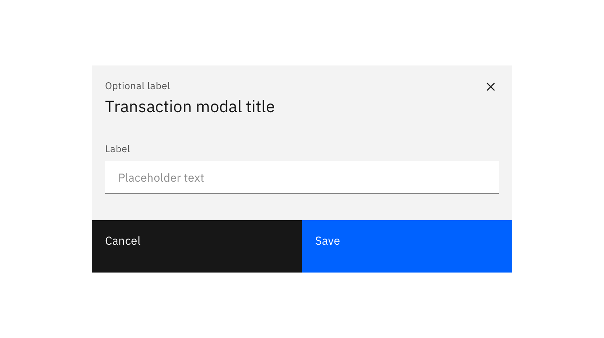

<AnchorLinks>

- [General guidance](#general-guidance)
- [Format](#format) 
- [Variations](#variations) 
- [Dismissal](#dismissal)

</AnchorLinks>

## General guidance

_Modals_ communicate information via a secondary window and allow the user to maintain the context of a particular task. Use modals sparingly because they interrupt user workflow.

## Format

#### Header

Include a heading within the modal that mirrors the action or button that was clicked by the user. Headers include a close button “x” in the upper right-hand corner of the modal.

#### Body

The body content within a modal should be as minimal as possible. Components that may be used in modals include: form fields, text area, select, and radio buttons.

#### Footer

The footer area of a modal typically contains a set of buttons. Refer to [button](/components/button) guidelines for usage.

## Variations

### Transactional modal

Transactional modals are used to validate user decisions or to gain secondary confirmation from the user. Typically, the modal requests either a 'yes' or 'no' response.

<ImageComponent cols="8">

</ImageComponent>

### Passive modal

This modal is used as a style of notifications. We highly discourage the use of this, due to its disruptive nature. Passive modal notifications should only appear if there is an action the user needs to address immediately. Passive modal notifications are persistent on-screen. That is, they do not automatically go away after appearing. Users must either engage with or dismiss the notification.

<ImageComponent cols="8">

</ImageComponent>

### Input modal

Modals used in this case include input areas that the user may interact with. These may include but are not limited to forms, dropdowns, selectors, and links.

<ImageComponent cols="8">

</ImageComponent>

## Dismissal

Modals may be dismissed in 3 ways:

- Using the “x” in the upper right-hand corner of the modal
- Pressing the `ESC` key
- Clicking / touching outside of the modal area
