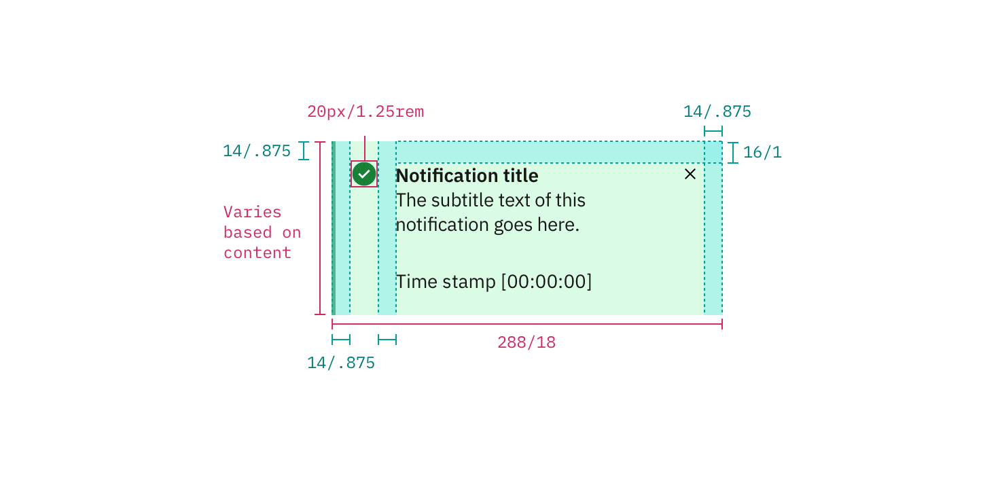
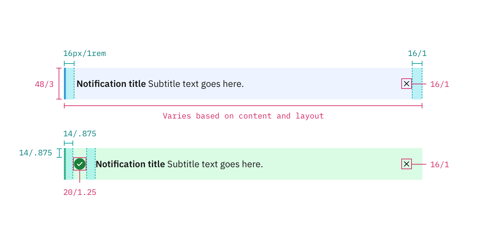

## Color

| Class                                                                          | Property         | SCSS        | HEX     |
| ------------------------------------------------------------------------------ | ---------------- | ----------- | ------- |
| `.bx--toast-notification`                                                      | background-color | $ui-01      | #ffffff |
| `.bx--toast-notification__title`   `.bx--inline-notification__title`       | color            | $text-01    | #152935 |
| `.bx--toast-notification__subtitle`   `.bx--inline-notification__subtitle` | color            | $text-02    | #5a6872 |
| `.bx--toast-notification__icon`   `.bx--inline-notification__close-icon`   | fill             | $ui-05      | #5a6872 |
| `.bx--toast-notification--error`   `.bx--inline-notification--error`       | border-left      | $support-01 | #e0182d |
| `.bx--toast-notification--info`   `.bx--inline-notification--info`         | border-left      | $support-04 | #5aaafa |
| `.bx--toast-notification--success`   `.bx--inline-notification--success`   | border-left      | $support-02 | #5aa700 |
| `.bx--toast-notification--warning`   `.bx--inline-notification--warning`   | border-left      | $support-03 | #efc100 |

## Typography

Notification titles should not exceed more than three words. Notification text should be set in sentence case with only the first word capitalized.

| Class                                                                          | Font-size (px/rem) | Font-weight     | Type style       |
| ------------------------------------------------------------------------------ | ------------------ | --------------- | ---------------- |
| `.bx--toast-notification__title`   `.bx--inline-notification__title`       | 14 / 0.875         | Semi-Bold / 600 | `.bx--type-zeta` |
| `.bx--toast-notification__subtitle`   `.bx--inline-notification__subtitle` | 14 / 0.875         | Normal / 400    | -                |

## Layer

| Class                     | Layer, Elevation | Box-shadow                     |
| ------------------------- | ---------------- | ------------------------------ |
| `.bx--toast-notification` | Overlay, 8       | 0 4px 8px 0 rgba(0, 0, 0, 0.1) |

## Structure

### Toast Notification

| Property                            | Property                                 | px / rem     | Spacing token |
| ----------------------------------- | ---------------------------------------- | ------------ | ------------- |
| `.bx--inline-notification`          | min-height                               | 40 / 2.5     | -             |
| `.bx--inline-notification`          | max-height                               | 56 / 3.5     | -             |
| `.bx--toast-notification`           | width                                    | 270 / 16.875 | -             |
| `.bx--toast-notification`           | margin-right                             | 16 / 1       | $spacing-md   |
| `.bx--toast-notification`           | margin-bottom                            | 8 / 0.5      | $spacing-xs   |
| `.bx--toast-notification`           | padding-top, padding-right, padding-left | 16 / 1       | $spacing-md   |
| `.bx--toast-notification`           | padding-bottom                           | 8 / 0.5      | $spacing-xs   |
| `.bx--toast-notification__title`    | padding-bottom                           | 2 / 0.125    | $spacing-2xs  |
| `.bx--toast-notification__subtitle` | margin-bottom                            | 16 / 1       | $spacing-md   |

_Structure and spacing measurements for a Toast Notification | px / rem_

### Inline Notification

The width of an Inline Notification will vary based on content.

| Property                                                                                                                                                     | Property                    | px / rem   | Spacing token |
| ------------------------------------------------------------------------------------------------------------------------------------------------------------ | --------------------------- | ---------- | ------------- |
| `.bx--inline-notification`                                                                                                                                   | min-height                  | 40 / 2.5   | -             |
| `.bx--inline-notification__close-icon` vv                                                                                                                    | height, width               | 10 / 0.625 | -             |
| `.bx--inline-notification--info`   `.bx--inline-notification--error`   `.bx--inline-notification--success`   `.bx--inline-notification--warning` | border                      | 1px        | -             |
| `.bx--inline-notification--info`   `.bx--inline-notification--error`   `.bx--inline-notification--success`   `.bx--inline-notification--warning` | border-left                 | 6px        | -             |
| `.bx--inline-notification__text-wrapper`                                                                                                                     | margin-left, margin-right   | 16 / 1     | $spacing-md   |
| `.bx--inline-notification`                                                                                                                                   | margin-top, margin-bottom   | 16 / 1     | $spacing-md   |
| `.bx--inline-notification`                                                                                                                                   | padding-top, padding-bottom | 12 / 0.75  | $spacing-sm   |
| `.bx--inline-notification`                                                                                                                                   | padding-left, padding-left  | 16 / 1     | $spacing-md   |

_Structure and spacing measurements for a Inline Notification | px / rem_
