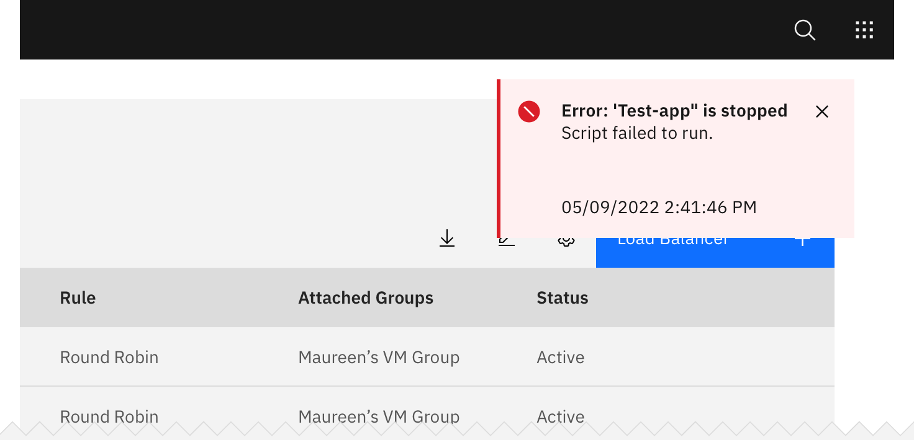
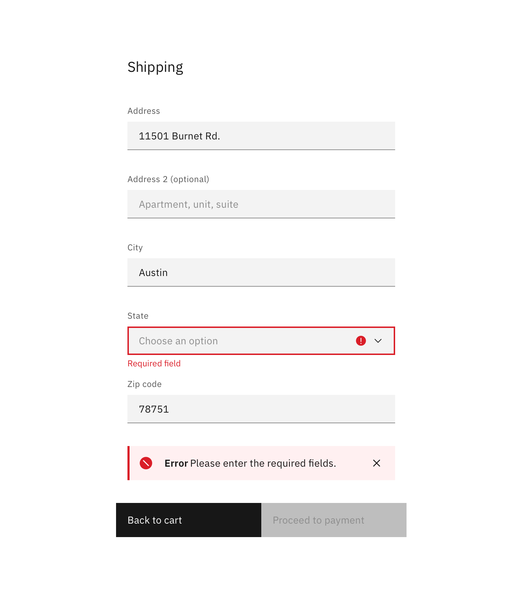

## Format

### Title

All notifications have subject titles, which should be short and descriptive. Example: **“Tester-app-02 has crashed.”**

### Message

We recommend the body of the Notification be contained within two lines. Be descriptive and include any troubleshooting actions or next steps. When possible, communicate the main message using just the title. You can include [Links](/components/link) within the Notification body that redirect the user to next steps.

### Dismissal

We recommend that Toast Notifications automatically disappear after five seconds. Inline Notifications are persistent until the user dismisses them. All notifications have at least one method of dismissal (typically, it is a small “x” in the upper right hand corner).

### Icons

Icons may provide additional clarity. Icons should be placed to the left of a title. These glyphs (16x16) can be found in the [iconography](/guidelines/iconography/library) library.

## Placement

### Toast Notifications

Toast Notifications slide in and out a page from the top-right corner. Actionable notifications do not appear on mobile screen widths.

### Inline Notifications

Inline Notifications appear near its related item. In [Forms](/components/form), we recommend placing the Inline Notification at the bottom of the Form, right before the submission buttons. Depending on the context of the page, Inline Notifications can appear above the content as well.

