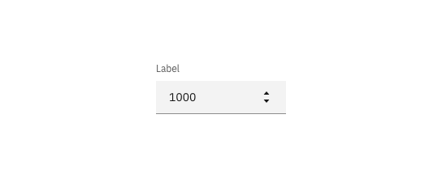

## Color

Inputs come in two different colors. The default input color is `$field-01` and is used on `$ui-01` page backgrounds. The light version input color is `$field-02` and is used on `$ui-02` page backgrounds.

| Class                              | Property         | SCSS      | HEX     |
| ---------------------------------- | ---------------- | --------- | ------- |
| `.bx--number`                      | background-color | $field-01 | #f4f7fb |
| `.bx--number--light`               | background-color | $field-02 | #ffffff |
| `.bx--label`                       | color            | $text-01  | #152935 |
| `.bx--number input[type='number']` | color            | $text-01  | #152935 |
| `.bx--number input[type='number']` | box-shadow       | $ui-05    | #5a6872 |
| `.bx--number__controls svg`        | fill             | $brand-01 | #3d70b2 |

_Number Input example in $field-02 (left) and $field-01 (right)_

### States

| Class                                                               | Property   | SCSS        | HEX     |
| ------------------------------------------------------------------- | ---------- | ----------- | ------- |
| `.bx--number input[type='number']:focus`                            | box-shadow | $brand-01   | #3d70b2 |
| `.bx--number input[type='number']:focus ~ .bx--label`               | color      | $brand-01   | #3d70b2 |
| `.bx--number[data-invalid] input[type='number']`                    | box-shadow | $support-01 | #e0182d |
| `.bx--number[data-invalid] input[type='number']:focus ~ .bx--label` | color      | $support-01 | #e0182d |
| `.bx--form-requirement`                                             | color      | $support-01 | #e0182d |

**Active:** Number input should have a default number to start. The input should never be empty.

**Help text:** Help text appears below the label when the input is active. Help text remains visible while the input is focused and disappears after focus away.

**Error:** Error messages appear below the input field and are always present while invalid.

**Disabled:** Disabled state appears at 50% opacity and has a `.not-allowed` cursor on hover.

## Typography

Number Input labels should use sentence case, with only the first word in a phrase and any proper nouns capitalized.

| Class                              | Font-size (px/rem) | Font-weight     | Type style          |
| ---------------------------------- | ------------------ | --------------- | ------------------- |
| `.bx--label`                       | 14 / 0.875         | Semi-Bold / 600 | `.bx--type-zeta`    |
| `.bx--number input[type='number']` | 14 / 0.875         | Normal / 400    | -                   |
| `.bx--form-requirement`            | 12 / 0.75          | Normal / 400    | `.bx--type-caption` |

## Structure

The height of a Number Input is always the same. The width however, varies based on content, layout and design. The caret icon can be found in the [iconography](/guidelines/iconography/library) library.

| Class                                    | Property      | px / rem | Spacing token |
| ---------------------------------------- | ------------- | -------- | ------------- |
| `.bx--number input[type='number']`       | height        | 40 / 2.5 | -             |
| `.bx--number input[type='number']`       | padding-left  | 16 / 1   | $spacing-md   |
| `.bx--number input[type='number']`       | padding-right | 32 / 2   | $spacing-xl   |
| `.bx--number input[type='number']`       | box-shadow    | 1px      | -             |
| `.bx--number input[type='number']:focus` | box-shadow    | 2px      | -             |

    

_Structure and spacing measurements for a Number Input | px / rem_
