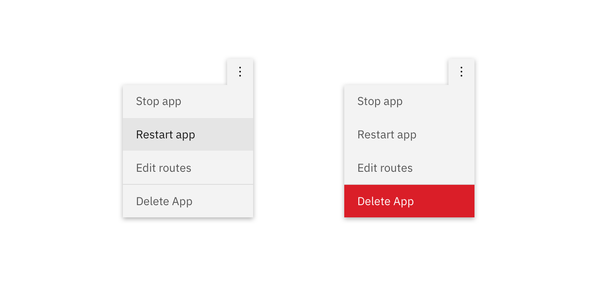
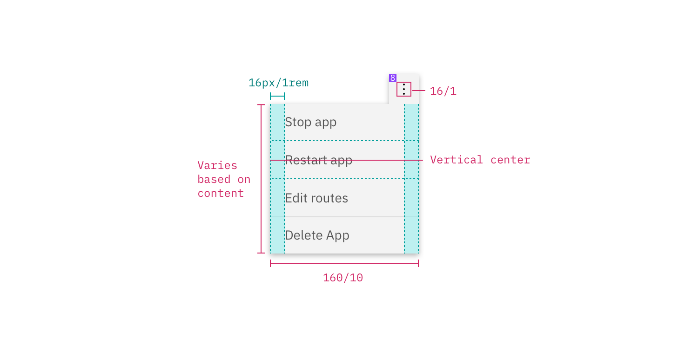

---

title: Overflow menu
tabs: ['Code', 'Usage', 'Style']
---

## Color

| Class                                              | Property         | SCSS          |
| -------------------------------------------------- | ---------------- | ------------- |
| `.bx--overflow-menu__icon`                         | fill             | $ui-05        |
| `.bx--overflow-menu-options`                       | background-color | $ui-01        |
| `.bx--overflow-menu-options__option:hover`         | background-color | $hover-row    |
| `.bx--overflow-menu-options__btn`                  | color            | $text-01      |
| `.bx--overflow-menu-options__option--danger:hover` | background-color | $hover-danger |
| `.bx--overflow-menu-options__option--danger`       | border-top       | $ui-04        |

<ImageComponent fixed="default" caption="Text and warning hover examples for overflow menu">

</ImageComponent>

## Typography

Overflow menu text should be set in set in sentence case with the first letter of the first word capitalized.

| Property                          | Font-size (px/rem) | Font-weight  | Type styles |
| --------------------------------- | ------------------ | ------------ | ----------- |
| `.bx--overflow-menu-options__btn` | 14 / 0.875         | Normal / 400 | -           |

## Layer

| Class                        | Layer, Elevation | Box-shadow                     |
| ---------------------------- | ---------------- | ------------------------------ |
| `.bx--overflow-menu-options` | Overlay, 8       | 0 4px 8px 0 rgba(0, 0, 0, 0.1) |

## Structure

The height of an overflow menu is determined by the amount of content in the menu. The overflow menu icon can be found in the [iconography](/style/iconography/library) library.

| Class                                        | Property                    | px / rem    | Spacing token |
| -------------------------------------------- | --------------------------- | ----------- | ------------- |
| `.bx--overflow-menu-options__btn`            | padding-top, padding-bottom | 8 / 0.5     | $spacing-xs   |
| `.bx--overflow-menu-options__btn`            | padding-right, padding-left | 16 / 1      | $spacing-md   |
| `.bx--overflow-menu__icon`                   | padding                     | 16 / 1      | $spacing-md   |
| `.bx--overflow-menu-options`                 | width                       | 180 / 11.25 | -             |
| `.bx--overflow-menu-options__option--danger` | border-top                  | 1px         | -             |

<ImageComponent fixed="default">

</ImageComponent>
