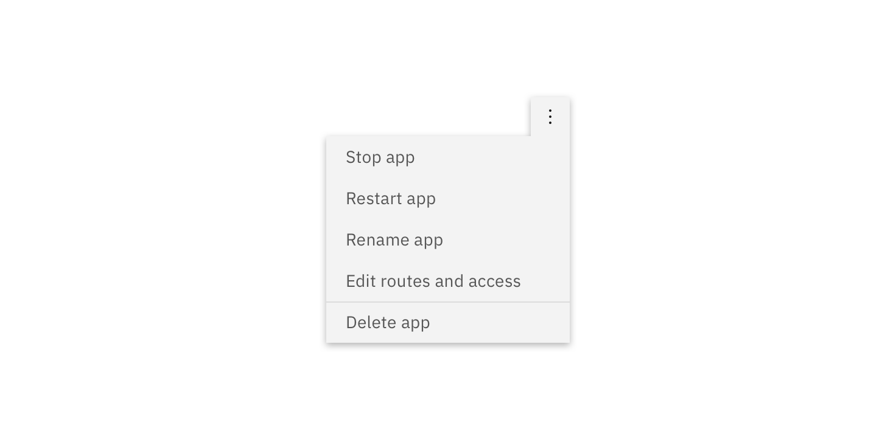
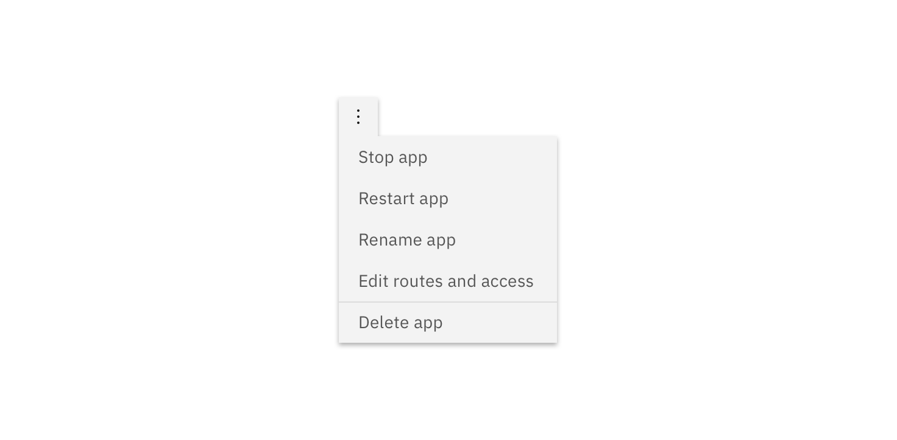

## General guidelines

### Text

The text within an Overflow Menu should be direct so users can quickly decide on an action. Actions that could cause a significant change to the user's data (Delete app, Delete service, etc.) is separated by a horizontal rule and live below the primary set of actions.

---
***
> 

### Positioning

Depending on where the Overflow Menu appears within the UI, the caret or arrow may be left or right aligned so the Overflow Menu is clearly visible.

---
***
> 

_Right-aligned Overflow Menu_

---
***
> 

_Left-aligned Overflow Menu_
