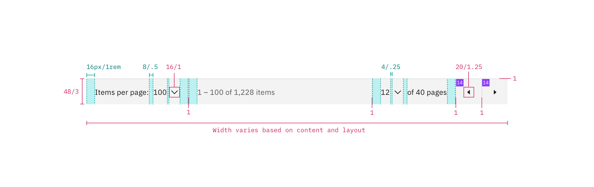

## Color

| Class                          | Property         | SCSS     | HEX     |
| ------------------------------ | ---------------- | -------- | ------- |
| `.bx--pagination`              | background-color | $ui-01   | #ffffff |
| `.bx--pagination`              | border           | $ui-04   | #8897a2 |
| `.bx--pagination__text`        | color            | $text-02 | #5a6872 |
| `.bx--pagination__button-icon` | fill             | $ui-05   | #5a6872 |

## Typography

Pagination text should be set in set in sentence case with the first letter of each word capitalized.

| Class                   | Font-size (px/rem) | Font-weight  | Text styles         |
| ----------------------- | ------------------ | ------------ | ------------------- |
| `.bx--pagination__text` | 12 / 0.75          | Normal / 400 | `.bx--type-caption` |

## Structure

The Pagination bar is most commonly used in [Data Tables](/components/data-table). The width can vary depending on content and layout, but should span the entire width of the table it's being paired with. The size of the chevron is 8px by 12px.

| Class                                                       | Property                    | px / rem  | Spacing token |
| ----------------------------------------------------------- | --------------------------- | --------- | ------------- |
| `.bx--pagination`                                           | height                      | 40 / 2.5  | -             |
| `.bx--pagination`                                           | border                      | 1px       | -             |
| `.bx--pagination`                                           | padding-left, padding-right | 16 / 1    | $spacing-md   |
| `.bx--pagination`                                           | padding-top, padding-bottom | 8 / 0.5   | $spacing-xs   |
| `.bx--pagination--inline`                                   | height                      | 40 / 2.5  | -             |
| `.bx--pagination--inline .bx--pagination__button--backward` | margin-left, margin-right   | 16 / 1    | $spacing-md   |
| `.bx--pagination--inline .bx--pagination__button--backward` | padding-left, padding-right | 16 / 1    | $spacing-md   |
| `.bx--pagination .bx--select-input`                         | padding-right               | 20 / 1.25 | -             |

_Structure and spacing measurements for Pagination | px / rem_
