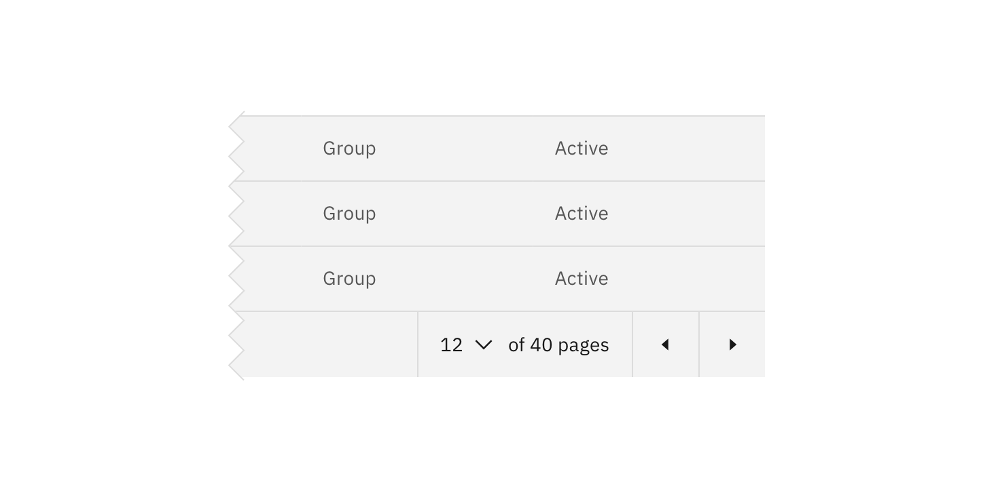
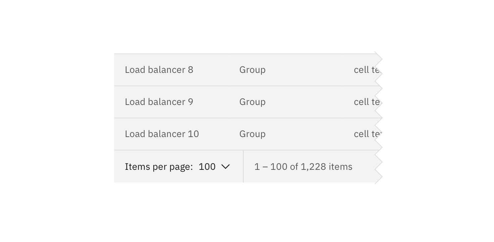

## Usage

Generally, Pagination is used if there are more than 25 items displayed in one view. The default number displayed will vary depending on the context.

## Best practices

### Identify the current page

Clearly identify which page the user is on my displaying the current page number. By providing context into how many pages there are in total (eg. 1 of 4 pages), you can help provide clarity around the data displayed.

### Provide various options for navigating

**Previous** and **next** chevrons or links are the most useful way for the user to move forward or backward through pages of data. Provide a [Inline select](/components/select) in which users can choose the page they wish to navigate to.

### Items per page

Use an Inline select within the Pagination bar so the user can change the amount of data displayed per page.

