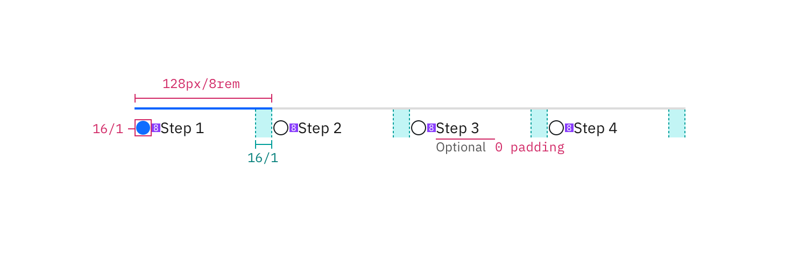
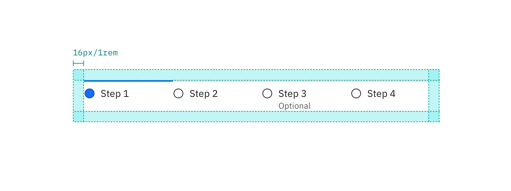

## Color

All steps that have already been completed are indicated by an outlined circle with a checkmark. The current step the user is on is indicated by a filled circle. Steps the user has not encountered yet, or future steps, are indicated by an outlined circle.

| Class                                                | Property         | SCSS      | HEX     |
| ---------------------------------------------------- | ---------------- | --------- | ------- |
| `.bx--progress-step svg`                             | fill             | $brand-01 | #3d70b2 |
| `.bx--progress-step--incomplete circle`              | fill             | $text-02  | #5a6872 |
| `.bx--progress-step--current .bx--progress-line`     | background-color | $brand-01 | #3d70b2 |
| `.bx--progress-step--incomplete .bx--progress-line`  | background-color | $ui-05    | #5a6872 |
| `.bx--progress-step--complete .bx--progress-label`   | color            | $brand-01 | #3d70b2 |
| `.bx--progress-step--incomplete .bx--progress-label` | color            | $ui-05    | #5a6872 |

---

---

> 

_Examples of current, completed, and future steps for Progress Indicator_

## Typography

Labels should be one to two words only, with a limit of 16 characters total per label. All labels should be set in sentence case.

| Class                                               | Font-size (px/rem) | Font-weight     | Type style       |
| --------------------------------------------------- | ------------------ | --------------- | ---------------- |
| `.bx--progress-step--complete.bx--progress-label`   | 14 / 0.875         | Semi-Bold / 600 | `.bx--type-zeta` |
| `.bx--progress-step--incomplete.bx--progress-label` | 14 / 0.875         | Normal / 400    | -                |

## Structure

The checkmark icon can be found in the [iconography](/guidelines/iconography/library) library.

| Class                    | Property       | px / rem | Spacing token |
| ------------------------ | -------------- | -------- | ------------- |
| `.bx--progress-step svg` | height, width  | 24 / 1.5 | -             |
| `.bx--progress-line`     | height, border | 1px      | -             |
| `.bx--progress-step`     | min-width      | 112 / 7  | -             |
| `.bx--progress-step svg` | margin-bottom  | 8 / 0.5  | $spacing-xs   |
| `.bx--progress-label`    | width          | 75%      | -             |

_Structure and spacing measurements for Progress Indicator | px / rem_

### Recommended

The following specs are not built into the Progress Indicator component but are recommended by design as the proper amount between Progress Indicator elements.

| Class           | Property | px / rem | Spacing token |
| --------------- | -------- | -------- | ------------- |
| `.bx--progress` | margin   | 16 / 1   | $spacing-md   |

_Recommended structure and spacing measurements for Progress Indicator | px / rem_
