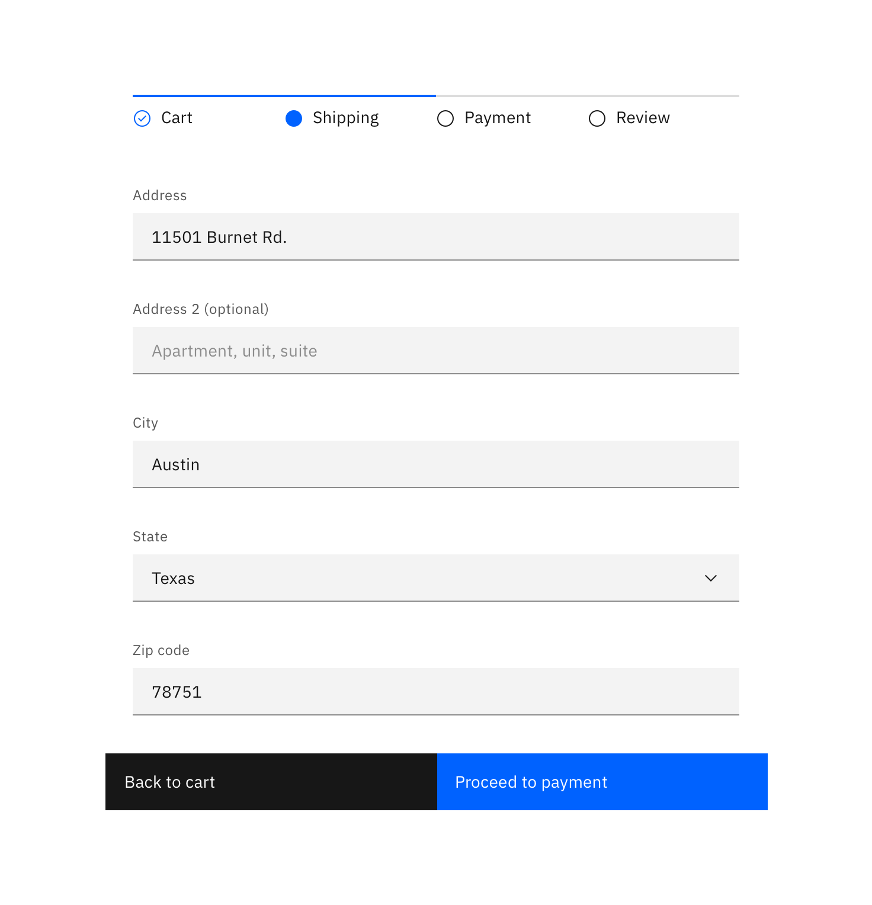

## General guidelines

Use Progress Indicators to keep the user on track when completing a specific task. By dividing the end goal into smaller, sub-tasks, it increases the percentage of completeness as each task is completed.

## Best practices

### Logical progression

Display the steps in order from left to right. Indicate to the user that they are performing a multi-step process, and show the direction of movement. Allow the user to return to a previous step to review their data submission.

### Indicate the current step

Keeping the user informed of where they currently are within the process or task at hand will give them a sense of control. This helps the user to know where they are in relation to where they have been, and what sections are to follow. Clear labels should accompany the Progress Indicator to indicate what the user will accomplish within each step. Keep labels between one to two words.

### Validation

Use validation to confirm that a previous step has been completed. If the user cannot proceed onto another step without first completing a task, use an [Inline Notification](/components/notification) to inform them.

_In-context Progress Indicator_
