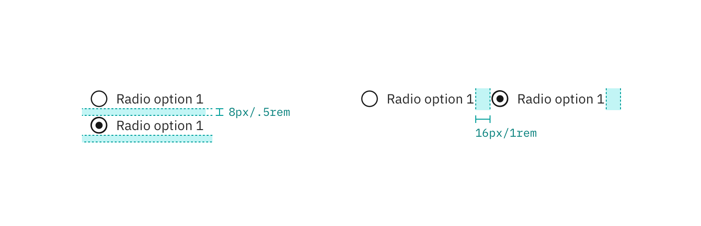

---

title: Radio button
tabs: ['Code', 'Usage', 'Style']
---

## Color

| Class                                   | Property         | SCSS      |
| --------------------------------------- | ---------------- | --------- |
| `.bx--radio-button__appearance`         | border           | $ui-05    |
| `.bx--radio-button__appearance`         | background-color | $ui-01    |
| `.bx--radio-button__appearance:checked` | border           | $brand-01 |
| `.bx--radio-button__appearance::before` | dot              | $brand-01 |

## Typography

_Radio button_ labels and headings should be set in sentence case, with only the first word in a phrase and any proper nouns capitalized.

| Class                      | Font-size (px/rem) | Font-weight     | Type style       |
| -------------------------- | ------------------ | --------------- | ---------------- |
| `.bx--label`               | 14 / 0.875         | Semi-Bold / 600 | `.bx--type-zeta` |
| `.bx--radio-button__label` | 14 / 0.875         | Normal / 400    | -                |

## Structure

| Class                                     | Property      | px / rem   | Spacing token |
| ----------------------------------------- | ------------- | ---------- | ------------- |
| `.bx--radio-button__appearance`           | height, width | 18 / 1.125 | -             |
| `.bx--radio-button__appearance:checked`   | height, width | 8 / 0.5    | -             |            
| `.bx--radio-button__label`                | margin-right  | 16 / 1     | $spacing-md   |
| `.bx--radio-button__appearance`           | margin-right  | 8 / 0.5    | $spacing-xs   |

<ImageComponent fixed="default" caption="Structure and spacing measurements for radio button | px | rem">

</ImageComponent>

### Recommended

The following specs are not built into the radio button component but are recommended by design as the proper amount of space around a grouping of or in between stacked radio buttons.

| Class                      | Property      | px / rem | Spacing token |
| -------------------------- | ------------- | -------- | ------------- |
| `.bx--radio-button-group`  | margin        | 16 / 1   | $spacing-md   |
| `.bx--radio-button__label` | margin-bottom | 16 / 1   | $spacing-md   |

<ImageComponent fixed="default" caption="Recommended structure and spacing measurements for radio button | px | rem">

</ImageComponent>
