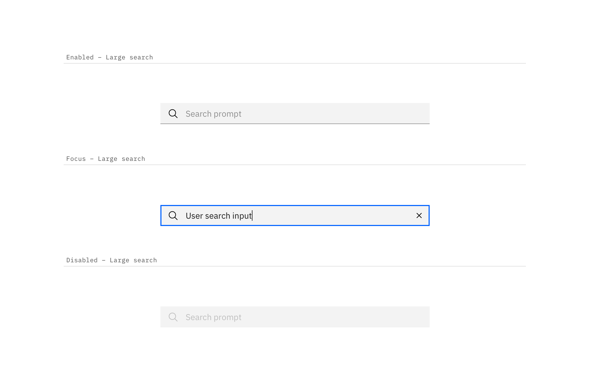

## Color

Inputs come in two different colors. The default input color is `$field-01` and is used on `$ui-01` page backgrounds. The light version input color is `$field-02` and is used on `$ui-02` page backgrounds.

| Class                            | Property         | SCSS      | HEX     |
| -------------------------------- | ---------------- | --------- | ------- |
| `.bx--search-input`              | background-color | $field-01 | #f4f7fb |
| `.bx--search--light`             | background-color | $field-02 | #ffffff |
| `.bx--search-input`              | color            | $text-01  | #152935 |
| `.bx--search-input::placeholder` | color            | $text-03  | #cdd1d4 |
| `.bx--search-magnifier`          | fill             | $ui-05    | #5a6872 |

_Example of Search using $field-02 (top) and $field-01 (bottom)_

_Examples of normal, hover, and input Search states_

## Typography

Search text should be set in sentence case, with only the first letter of the first word capitalized.

| Property                        | Font-size  | Font-weight     | Type style       |
| ------------------------------- | ---------- | --------------- | ---------------- |
| `.bx--search-input`             | 14 / 0.875 | Semi-Bold / 600 | `.bx--type-zeta` |
| `.bx--search-input:placeholder` | 14 / 0.875 | Normal / 400    | -                |

## Structure

The width of the Search field should appropriately fit the design and layout of content. Larger Search fields can include a filter button and a list/card view button.

| Class                                             | Property                    | px / rem | Spacing token |
| ------------------------------------------------- | --------------------------- | -------- | ------------- |
| `.bx--search--lg .bx--search-input`               | height                      | 40 / 2.5 | -             |
| `.bx--search--sm .bx--search-input`               | height                      | 32 / 2   | -             |
| `.bx--search-magnifier`   `.bx--search-close` | height, width               | 16 / 1   | -             |
| `.bx--search-input`                               | padding-left, padding-right | 40 / 2.5 | $spacing-2xl  |

_Structure and spacing measurements for Regular Search | px | rem_

_Structure and spacing measurements for Small Search | px | rem_
