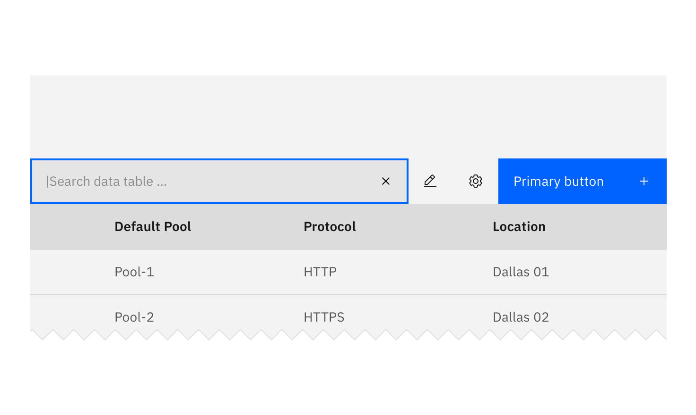

## General guidelines

### Search variations

**Large Search** should be used at a global level, when the user is searching content within a page view.

**Small Search** can be used when there are space constraints in your design. It can also be component specific. For example, Small Search can be used to filter data within a [Data Table](/components/data-table).

_Small Search to filter table data_

### Search fields

Set users' context for the search with helpful placeholder text within the search field (Search Docs), that pertains to the page or section the search box is in. Search in the global header should just say Search.

### Search results

- Clearly show which results are being displayed with labels or headers (i.e. Results for X).
- Categorize the search results if they come from different areas (eg. docs, services, apps, tutorials, blogs).
- Give the user control over their viewing options and ability to sort results (eg. relevancy, popularity, ratings, date).
- Have a clear, “No results,” message and offer suggestions if possible.
- Have smart algorithms that can search for similar terms or can search even with misspelled words.
- Include enough of a description in the results for users to make a judgement as to whether that particular result is relevant.
- Highlight the search term in the results, where appropriate.
