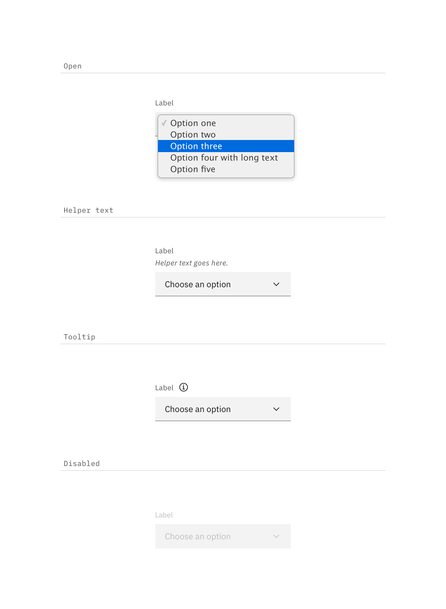
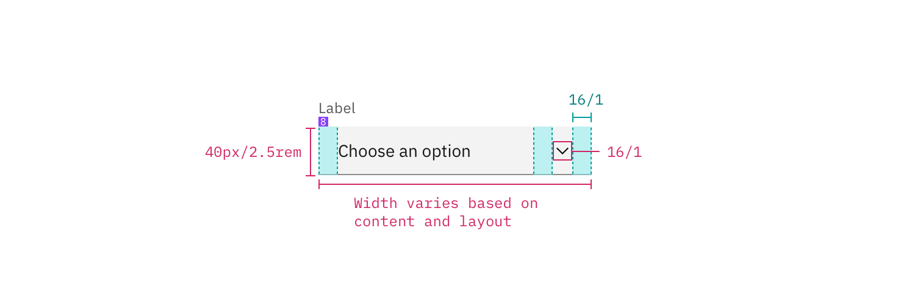
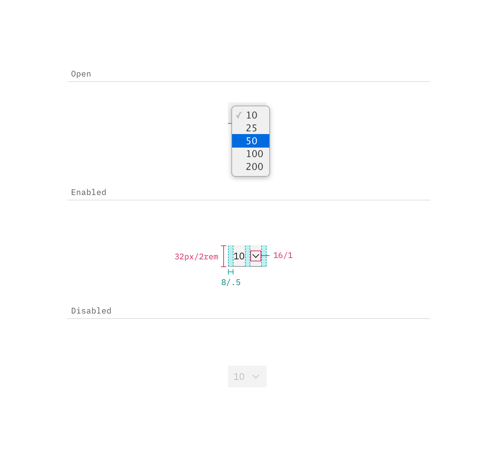

## Color

Inputs come in two different colors. The default input color is `$field-01` and is used on `$ui-01` page backgrounds. The light version input color is `$field-02` and is used on `$ui-02` page backgrounds.

| Class                                  | Property   | SCSS        | HEX     |
| -------------------------------------- | ---------- | ----------- | ------- |
| `.bx--select-input`                    | background | $field-01   | #f4f7fb |
| `.bx--select-input`                    | color      | $text-01    | #152935 |
| `.bx--select-input::placeholder`       | color      | $text-03    | #cdd1d4 |
| `.bx--select--light.bx--select-input`  | background | $field-02   | #ffffff |
| `.bx--select--inline.bx--select-input` | background | transparent | -       |
| `.bx--label`                           | color      | $text-01    | #152935 |
| `.bx--label`                           | color      | $text-01    | #152935 |
| `.bx--select__arrow`                   | fill       | $brand-01   | #3d70b2 |
| `.bx--select--inline.bx--select-input` | color      | $brand-01   | #3d70b2 |

_Examples of default and new selection Select states in $field-02 (right) and $field-01 (left)_

### States

| Class                                                | Property      | SCSS        | HEX     |
| ---------------------------------------------------- | ------------- | ----------- | ------- |
| `.bx--select-input:focus`                            | border-bottom | $brand-01   | #3d70b2 |
| `.bx--select-input:focus ~ .bx--label`               | color         | $brand-01   | #3d70b2 |
| `.bx--select-input[data-invalid]:focus ~ .bx--label` | color         | $support-01 | #e0182d |
| `.bx--form-requirement`                              | color         | $support-01 | #e0182d |
| `.bx--select-input[data-invalid]`                    | border-bottom | $support-01 | #e0182d |

**Open:** Style determined by browser

**Help text:** Help text appears below the label when the input is active. Help text remains visible while the input is focused and disappears after focus away.

**Error:** Error messages appear below the input field and are always present while invalid.

**Disabled:** Disabled state has a `.not-allowed` cursor hover and appears at 50% opacity.

    

_Examples of open, disabled, and help Select states_

## Typography

Select text should be set in sentence case, with only the first word in a phrase and any proper nouns capitalized. Select text should be three words or less.

| Class                                  | Font-size (px/rem) | Font-weight     | Type style          |
| -------------------------------------- | ------------------ | --------------- | ------------------- |
| `.bx--label`                           | 14 / 0.875         | Semi-Bold / 600 | `.bx--type-zeta`    |
| `.bx--select--inline .bx--label`       | 14 / 0.875         | Normal / 400    | -                   |
| `.bx--select-input`                    | 14 / 0.875         | Normal / 400    | -                   |
| `.bx--select--inline.bx--select-input` | 14 / 0.875         | Semi-Bold / 600 | `.bx--type-zeta`    |
| `.bx--form-requirement`                | 12 / 0.75          | Normal / 400    | `.bx--type-caption` |

## Structure

### Select

| Class                     | Property      | px / rem | Spacing token |
| ------------------------- | ------------- | -------- | ------------- |
| `.bx--select-input`       | height        | 40 / 2.5 | -             |
| `.bx--label`              | margin-bottom | 8 / 0.5  | $spacing-xs   |
| `.bx--select-input`       | padding-right | 2.5 / 40 | $spacing-2xl  |
| `.bx--select-input`       | padding-left  | 16 / 1   | $spacing-md   |
| `.bx--select-input`       | box-shadow    | 1px      | -             |
| `.bx--select-input:focus` | box-shadow    | 2px      | -             |

_Structure and spacing measurements for Select | px / rem_

### Recommended

The following specs are not built into the Select component but are recommended by design as the proper amount of space between a Select and other form elements/components.

| Class         | Property                  | px / rem | Spacing token |
| ------------- | ------------------------- | -------- | ------------- |
| `.bx--select` | margin-top, margin-bottom | 16 / 1   | $spacing-md   |
| `.bx--select` | margin-left, margin-right | 8 / 0.5  | $spacing-xs   |

### Small Select

| Class               | Property                    | px / rem | Spacing token |
| ------------------- | --------------------------- | -------- | ------------- |
| `.bx--select-input` | height                      | 24 / 1.5 | -             |
| `.bx--select-input` | padding-left, padding-right | 8 / 0.5  | $spacing-xs   |

  

    
  

  

    
  

_Structure and spacing measurements for Small Select | px / rem & examples of open and disabled Small Select states_

### Recommended

The following specs are not built into the Small Select component but are recommended by design as the proper width for a Small Select.

| Class               | Property | px / rem | Spacing token |
| ------------------- | -------- | -------- | ------------- |
| `.bx--select-input` | width    | 56 / 3.5 | -             |

### Inline select

| Class               | Property      | px / rem | Spacing token |
| ------------------- | ------------- | -------- | ------------- |
| `.bx--select-input` | height        | 32 / 2   | -             |
| `.bx--select-input` | padding-right | 2.5 / 40 | $spacing-2xl  |
| `.bx--select-input` | padding-left  | 16 / 1   | $spacing-md   |

    

_Structure and spacing measurements for Inline Select (focused) | px / rem_
