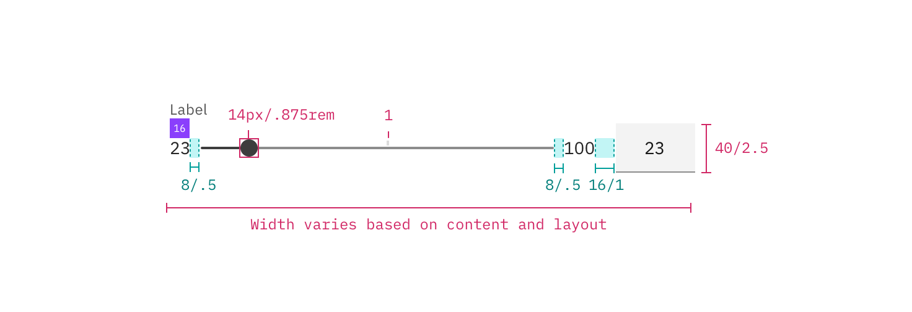

---

title: Slider
tabs: ['Code', 'Usage', 'Style']
---

## Color

| Class                       | Attribute        | SCSS      |
| --------------------------- | ---------------- | --------- |
| `.bx--slider__thumb`        | fill             | $brand-01 |
| `.bx--slider__filled-track` | background-color | $brand-01 |
| `.bx--slider__track`        | background-color | $ui-04    |
| `.bx--label`                | color            | $text-01  |
| `.bx--slider__range-label`  | color            | $text-02  |

## Typography

_Slider_ labels should be set in sentence case, with only the first word in a phrase and any proper nouns capitalized, and no more than three words.

| Class                      | Font-size (px/rem) | Font-weight     | Type style       |
| -------------------------- | ------------------ | --------------- | ---------------- |
| `.bx--label`               | 14 / 0.875         | Semi-Bold / 600 | `.bx--type-zeta` |
| `.bx--slider__range-label` | 14 / 0.875         | Normal / 400    | -                |

## Structure

The width of a slider varies based on page content and layout.

| Class                                   | Property                  | px / rem | Spacing token |
| --------------------------------------- | ------------------------- | -------- | ------------- |
| `.bx--slider__thumb`                    | height, width             | 24 / 1.5 | -             |
| `.bx--slider__track`                    | height                    | 4 / 0.25 | -             |
| `.bx--label`                            | margin-bottom             | 8 / 0.5  | $spacing-xs   |
| `.bx--slider`                           | margin-left, margin-right | 16 / 1   | $spacing-md   |
| `.bx--slider__range-label:last-of-type` | margin-right              | 16 / 1   | $spacing-md   |

<image-component fixed="default" caption="Structure and spacing measurements for slider | px / rem">

</image-component>

### Recommended

The following specs are not built into the slider component but are recommended by design as the proper sizing for the slider tracking line.

| Class               | Property  | px / rem   | Spacing token |
| ------------------- | --------- | ---------- | ------------- |
| `.bx--slider-track` | min-width | 200 / 12.5 | -             |
| `.bx--slider-track` | max-width | 640 / 40   | -             |
