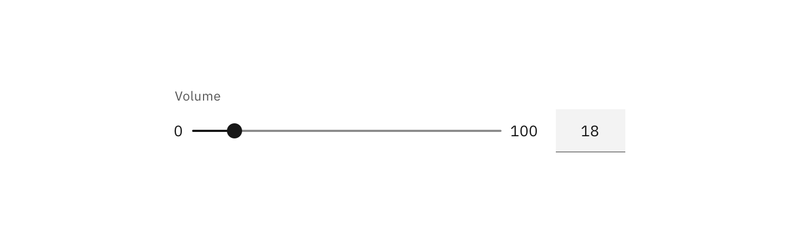

## Types of Sliders

The Slider in its basic form should be accompanied by a label and a number input that can demonstrate the slider input's increase or decrease. The basic slider does **not** include values as the slider represents a percentage of 0-100. In this case it is not necessary for a user to choose a specific value, but instead generally increase or decrease an input. For example, the user increases the Slider amount and the volume of the music gets louder. The more complex versions should be used for selecting a specific value within a value range.

_Slider used to change volume_

## Interaction

Users can choose a numerical value by:

- Entering the exact value into the text field.
- Moving the Slider handle with their mouse, which automatically updates the value in the Text Input.
- Using the ↑ ↓ ← → arrow keys automatically updates the value in the Text Input and moves the Slider handle to the corresponding value.
- The **step size increment** is how many increments the inputted value and Slider handle will jump when using the arrow keys. Make sure to set the step size increments to reasonable values.
- ↑ ↓ ← → changes the value by one step size increment. (_Example: Pressing `→` changes the inputted value from 59 to 60, increasing the value by 1 unit._)
- `Shift` + ↑ ↓ ← → changes the value by 10 step size increments. (_Example: Typing `Shift + →` changes the value from 60 to 70, increasing the inputted value by 10 units._)

_Example of a Slider interaction_

## Best practices

- The Slider label should indicate what value the Slider is changing.
- Range values are used to describe the range in numbers.
- Do not use for ranges that are extremely large _(ex. 1-1000)_.
- Do not use for ranges that are too small _(ex. 1-3)_.
