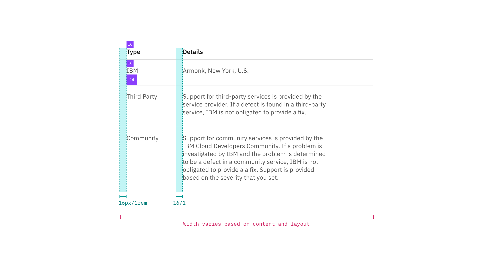
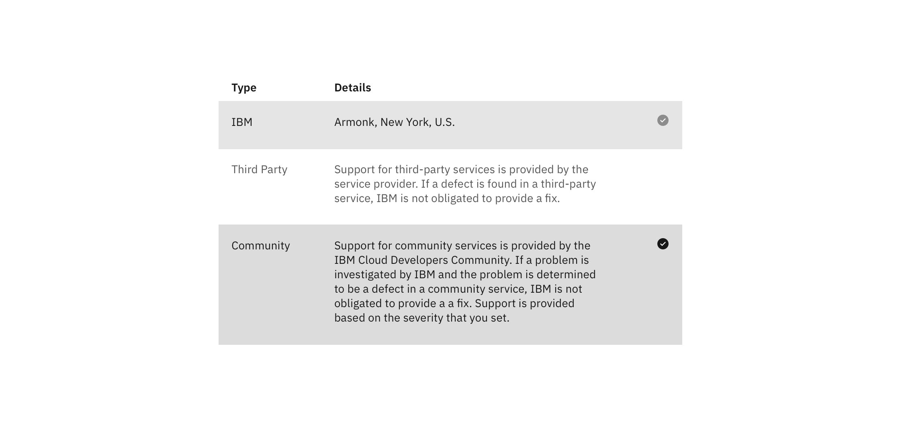

## Color

| Class                                                                      | Property         | SCSS       | HEX                    |
| -------------------------------------------------------------------------- | ---------------- | ---------- | ---------------------- |
| `.bx--structured-list-th`   `.bx--structured-list-td`                  | color            | $text-01   | #152935                |
| `.bx--structured-list-row--header-row`                                     | border-bottom    | $brand-01  | #3d70b2                |
| `.bx--structured-list-row`                                                 | border-bottom    | $ui-03     | #dfe3e6                |
| `.bx--structured-list--border`                                             | border           | $ui-04     | #8897a2                |
| `.bx--structured-list-row--selected`                                       | background-color | $hover-row | #5596e6 at 10% opacity |
| `.bx--structured-list-row:hover:not(.bx--structured-list-row--header-row)` | background-color | $hover-row | #5596e6 at 10% opacity |
| `.bx--structured-list-input:checked + .bx--structured-list-svg`            | fill             | $brand-02  | #5596e6                |

## Typography

Structured List headers should be set in all caps, while all other text is set in sentence case. All typography is left aligned. **Line height** for Structured Lists should be set at 18px / 1.25rem.

| Property                  | Font-size (px/rem) | Font-weight     | Type style        |
| ------------------------- | ------------------ | --------------- | ----------------- |
| `.bx--structured-list-th` | 12 / 0.75          | Semi-Bold / 600 | `.bx--type-omega` |
| `.bx--structured-list`    | 14 / 0.875         | Normal / 400    | -                 |

## Structure

Structured Lists by default are not accompanied by a border, but one may be added for stylistic purposes, and should be set at 1px.

| Property                                                  | Property                    | px / rem    | Spacing token |
| --------------------------------------------------------- | --------------------------- | ----------- | ------------- |
| `.bx--structured-list`                                    | min-width                   | 500 / 31.25 | -             |
| `.bx--structured-list-td`   `.bx--structured-list-th` | padding-top, padding-bottom | 16 / 1      | $spacing-md   |
| `.bx--structured-list-td`   `.bx--structured-list-th` | padding-right               | 32 / 2      | $spacing-xl   |
| `[data-structured-list] .bx--structured-list-td`          | padding-left, padding-right | 16 / 1      | $spacing-md   |
| `.bx-structured-list-condensed`                           | padding-top, padding-bottom | 10 / 0.625  | -             |
| `.bx--structured-list-svg`                                | height, width               | 16 / 1      | -             |

_Spacing and measurements for Structured List | px / rem_

_Spacing and measurements for Structured List with selection | px / rem_
