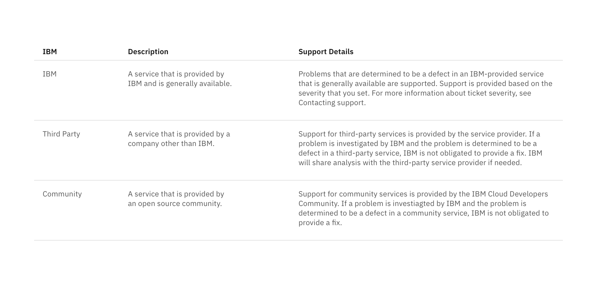

## Content

- Row height varies based on content, and can expand to fit multiple lines.
- Column widths can either be equally proportional or proportioned based on content.
- If your list extends past 25 items, consider using a [Data Table](/components/data-table) to present this larger set of content.
- A maximum of one paragraph of text is recommended.
- Nesting items is not recommended, as Structured Lists are used to present simple data. If you have additional content that needs to be shown, consider using a [Data Table,](/components/data-table) which supports nesting items.

_Structured List to present definitions_

## Interaction

Structured lists can be single-select if a user is choosing between a set of options.

**Guidelines:**

- Only one item can be selected from the list.
- By default, one option should be selected.
- If you need to select multiple items, use a [Data Table.](/components/data-table)
- When the user selects an item from the list, the selected row will appear with the `checkmark--glyph` icon.
