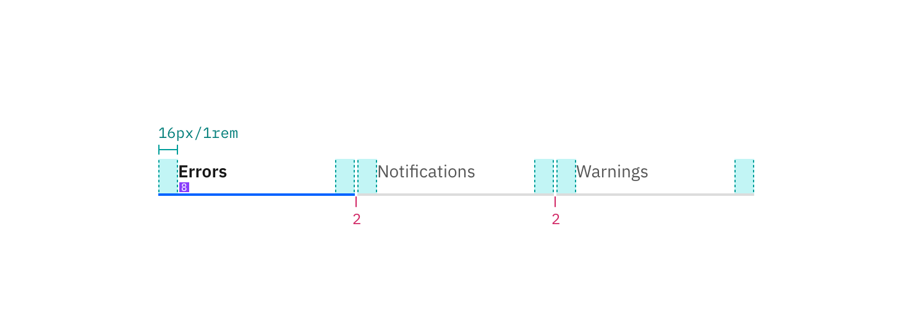

## Color

| Class                                               | Property      | SCSS                | HEX     |
| --------------------------------------------------- | ------------- | ------------------- | ------- |
| `.bx--tabs__nav-item--selected .bx--tabs__nav-link` | color         | $brand-01           | #3d70b2 |
| `.bx--tabs__nav-item--selected`                     | border-bottom | $brand-01           | #3d70b2 |
| `.bx--tabs__nav-link`                               | color         | $text-01            | #152935 |
| `.bx--tabs__nav-link:hover`                         | color         | $hover-primary-text | #294c86 |

## Typography

Tab label should be set in sentence case, and should not exceed three words.

| Class       | Font-size (px/rem) | Font-weight     | Type style       |
| ----------- | ------------------ | --------------- | ---------------- |
| `.bx--tabs` | 14 / 0.875         | Semi-Bold / 600 | `.bx--type-zeta` |

## Structure

| Class                                       | Property                    | px / rem | Spacing token |
| ------------------------------------------- | --------------------------- | -------- | ------------- |
| `.bx--tabs__nav-item--selected`             | border-bottom               | 2px      | -             |
| `.bx--tabs__nav-item + .bx--tabs__nav-item` | margin-left                 | 48 / 3   | $spacing-2xl  |
| `.bx--tabs__nav-item`                       | padding-top, padding-bottom | 16 / 1   | $spacing-md   |

_Structure and spacing measurements for Tab | px / rem_
