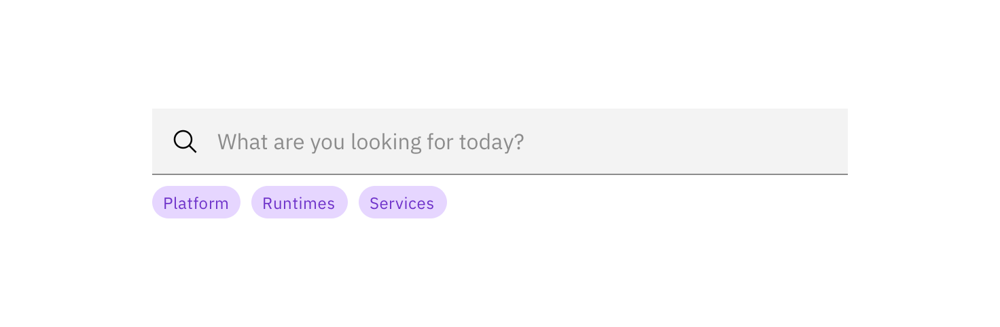
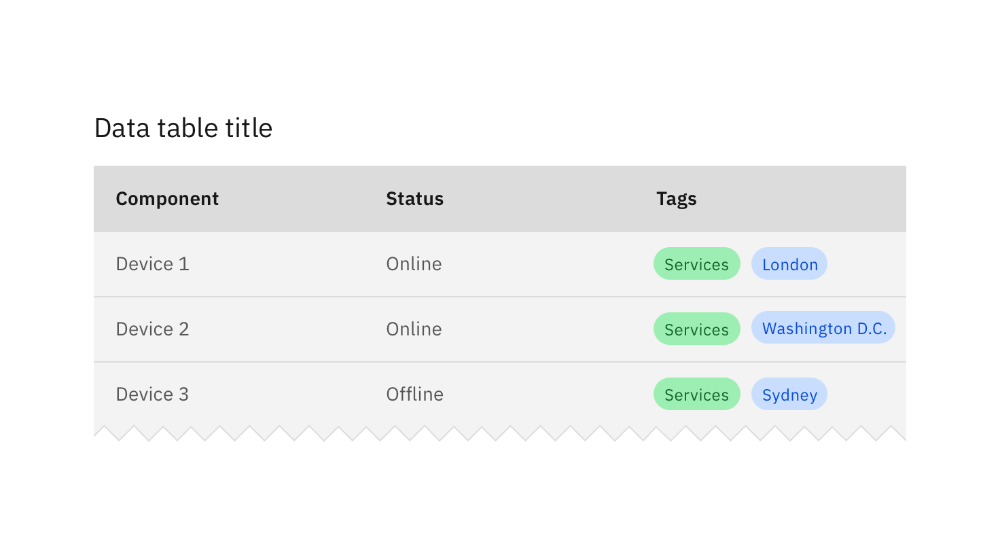

## General guidelines

Multiple or single tags can be used to categorize items.

Use Tags when content is mapped to multiple categories, and the user needs a way to differentiate between them.

Tags can also be used as a method of filtering data, to show only items within that particular category.

