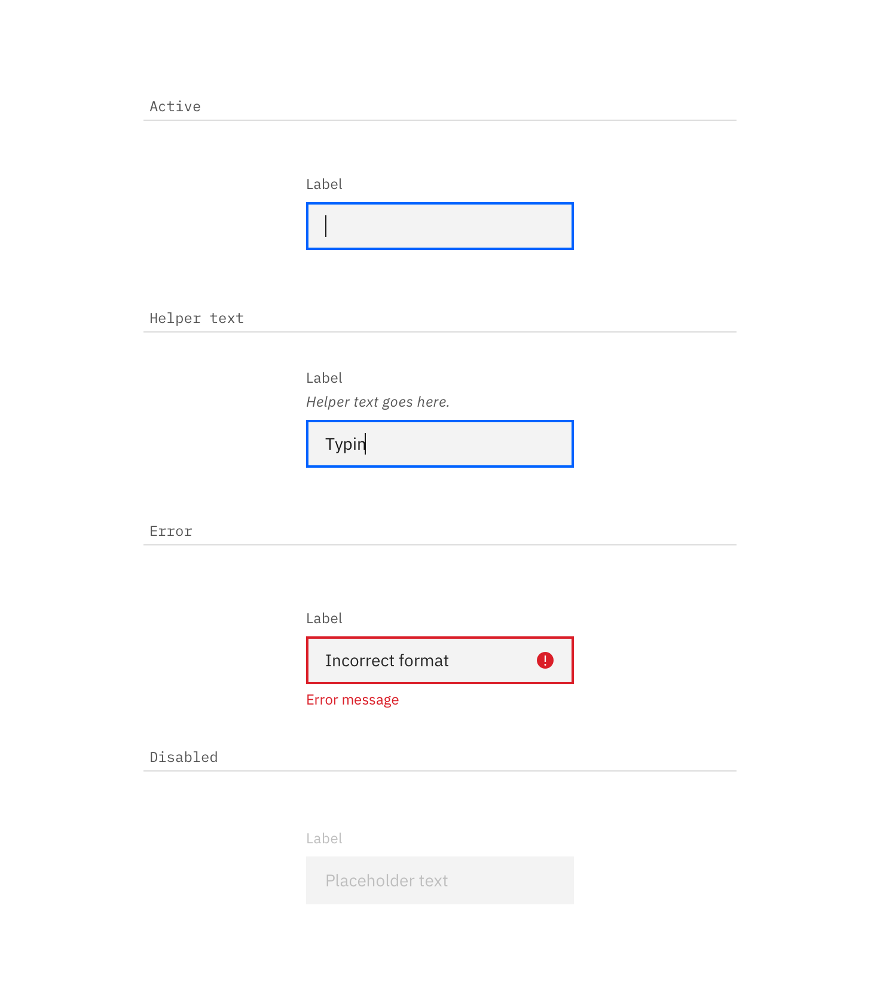

## Color

Text inputs come in two different colors. The default input color is `$field-01` and is used on `$ui-01` page backgrounds. The light version input color is `$field-02` and is used on `$ui-02` page backgrounds.

| Class                          | Property         | SCSS      | HEX     |
| ------------------------------ | ---------------- | --------- | ------- |
| `.bx--label`                   | color            | $text-01  | #152935 |
| `.bx--text-input`              | background-color | $field-01 | #f4f7fb |
| `.bx--text-input`              | box-shadow       | $ui-05    | #5a6872 |
| `.bx--text-input`              | color            | $text-01  | #152935 |
| `.bx--text-input::placeholder` | color            | $text-03  | #cdd1d4 |
| `.bx--text-input--light`       | background-color | $field-02 | #ffffff |
| `.bx--form__helper-text`       | color            | $text-02  | #5a6872 |

_Examples of default and user-input states for Text Input in both $field-02 (left) and $field-01 (right)_

### States

| Class                                                                | Property   | SCSS        | HEX     |
| -------------------------------------------------------------------- | ---------- | ----------- | ------- |
| `.bx--text-input:focus`                                              | box-shadow | $brand-01   | #3d70b2 |
| `.bx--text-input[data-invalid], .bx--text-input[data-invalid]:focus` | box-shadow | $support-01 | #e0182d |
| `.bx--text-input:focus ~ .bx--label`                                 | color      | $brand-01   | #3d70b2 |
| `.bx--form-requirement`                                              | color      | $support-01 | #e0182d |
| `.bx--form-requirement`                                              | color      | $support-01 | #e0182d |

**Active:** Placeholder text should remain when the user clicks into the text input and gets a cursor. Once the user starts typing the hint text is replaced with the user input text.

**Help text:** Help text appears below the label when the text input is active. Help text remains visible while the input is focused and disappears after focus away.

**Error:** Error messages appear below the input field and are always present while invalid.

**Disabled:** Disabled state appears at 50% opacity and has a `.not-allowed` cursor on hover.

## Typography

Text Input labels and placeholder text should be set in sentence case, with only the first word in a phrase and any proper nouns capitalized. Text Input labels should be three words or less.

| Class                    | Font-size (px/rem) | Font-weight     | Type style          |
| ------------------------ | ------------------ | --------------- | ------------------- |
| `.bx--label`             | 14 / 0.875         | Semi-Bold / 600 | `.bx--type-zeta`    |
| `.bx--text-input`        | 14 / 0.875         | Normal / 400    | -                   |
| `.bx--form__helper-text` | 12 / 0.75          | Normal / 400    | `.bx--type-caption` |
| `.bx--form-requirement`  | 12 / 0.75          | Normal / 400    | `.bx--type-caption` |

## Structure

| Class                   | Property                    | px / rem | Spacing token |
| ----------------------- | --------------------------- | -------- | ------------- |
| `.bx--text-input`       | height                      | 40 / 2.5 | -             |
| `.bx--label`            | margin-bottom               | 8 / 0.5  | $spacing-xs   |
| `.bx--text-input`       | padding-left, padding-right | 16 / 1   | $spacing-md   |
| `.bx--text-input`       | box-shadow                  | 1px      | -             |
| `.bx--text-input:focus` | box-shadow                  | 2px      | -             |

_Structure and spacing measurements for Text Input | px / rem_

    

_Examples of active, help, error and disabled Text Input states_
