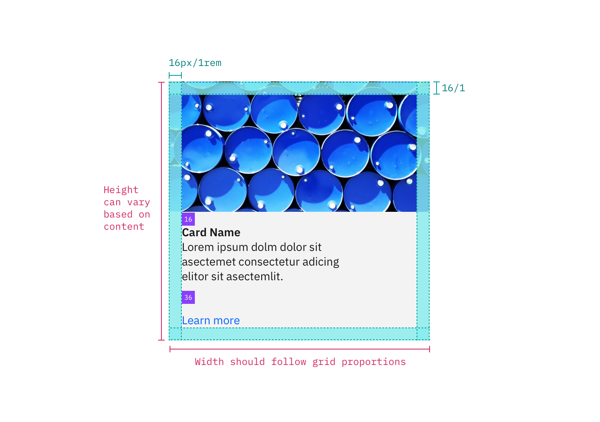

---

title: Tile
tabs: ['Code', 'Usage', 'Style']
---

## Color

| Class                                                                                                | Property         | SCSS      |
| ---------------------------------------------------------------------------------------------------- | ---------------- | --------- |
| `.bx--tile`                                                                                          | background-color | $ui-01    |
| `.bx--tile`                                                                                          | border           | $ui-03    |
| `.bx--tile:focus`                                                                                    | border           | $brand-01 |
| `.bx--tile--is-selected`   `.bx--tile--is-selected:hover`   `.bx--tile--is-selected:focus`   | border           | $brand-01 |
| `.bx--tile__chevron svg`                                                                             | fill             | $brand-01 |
| `.bx--tile__checkmark svg`                                                                           | fill             | $brand-01 |
| `.bx--tile--clickable:hover`   `.bx--tile--selectable:hover`   `.bx--tile--expandable:hover` | border           | $ui-04    |

## Layer

| Class       | Layer, Elevation | Box-shadow                    |
| ----------- | ---------------- | ----------------------------- |
| `.bx--tile` | Raised, 2        | 0 1px 2px 0 rgba(0,0,0,0.10); |

## Structure

| Class       | Property   | px / rem         | Spacing token |
| ----------- | ---------- | ---------------- | ------------- |
| `.bx--tile` | min-height | 64 / 4           | -             |
| `.bx--tile` | min-width  | 128 / 8          | -             |
| `.bx--tile` | padding    | 16 / 1 (minimum) | $spacing-md   |

<image-component fixed="default" caption="Structure and spacing measurements for Tile | px / rem">

</image-component>

### Proportions for grid

|      | XL 1600-1200 | L 1200-992 | M 992-768 | S 768-576 | XS 576-0 |
| ---- | ------------ | ---------- | --------- | --------- | -------- |
| 100% | ✅           | ✅         | ✅        | ✅        | ✅       |
| 1/2  | ✅           | ✅         | ✅        | ✅        | ✅       |
| 2/3  | ✅           | ✅         | ✅        | ✅        |          |
| 1/3  | ✅           | ✅         | ✅        | ✅        |          |
| 1/4  | ✅           | ✅         | ✅        | ✅        |          |
| 1/6  | ✅           | ✅         |           |           |          |
