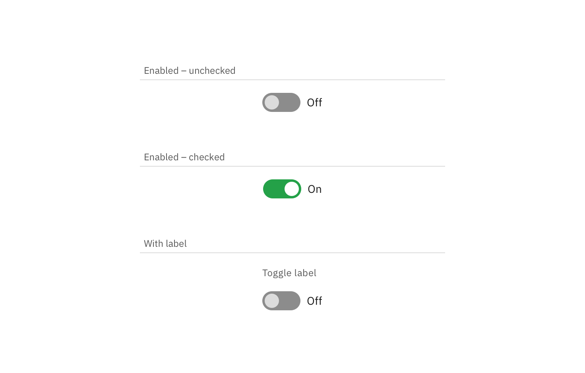

## Color

| Class                                                                    | Property                 | SCSS      | HEX     |
| ------------------------------------------------------------------------ | ------------------------ | --------- | ------- |
| `.bx--toggle__appearance:after`                                          | background-color         | $ui-01    | #ffffff |
| `.bx--toggle__appearance:after`                                          | border                   | $ui-05    | #5a6872 |
| `.bx--toggle--small + .bx--toggle__label .bx--toggle__appearance:before` | border                   | $ui-05    | #5a6872 |
| `.bx--toggle:checked + .bx--toggle__label .bx--toggle__appearance:after` | background-color, border | $brand-01 | #3d70b2 |
| `.bx--toggle__check`                                                     | fill                     | $brand-01 | #3d70b2 |
| `.bx--toggle__label`                                                     | color                    | $text-01  | #152935 |

    

_Examples of inactive, inactive hover, and active states for a Toggle_

## Typography

Toggle labels should be set in sentence case, with only the first word in a phrase and any proper nouns capitalized, and no more than three words.

| Class                                                      | Font-size (px/rem) | Font-weight  | Text style       |
| ---------------------------------------------------------- | ------------------ | ------------ | ---------------- |
| `.bx--label`                                               | 14 / 0.875         | Normal / 600 | `.bx--type-zeta` |
| `.bx--toggle__text--left`   `.bx--toggle__text--right` | 14 / 0.875         | Normal / 400 | -                |

## Structure

### Toggle

| Class                                                      | Property                  | px / rem | Spacing token |
| ---------------------------------------------------------- | ------------------------- | -------- | ------------- |
| `.bx--toggle__appearance`                                  | width                     | 48 / 3   | -             |
| `.bx--toggle__appearance:after`                            | height, width             | 24 / 1.5 | -             |
| `.bx--toggle__appearance:after`                            | border                    | 2px      | -             |
| `.bx--toggle__label`                                       | margin-top, margin-bottom | 16 / 1   | $spacing-md   |
| `.bx--toggle__text--left`   `.bx--toggle__text--right` | margin-right, margin-left | 8 / 0.5  | $spacing-xs   |

    

_Structure and spacing measurements for Toggle | px / rem_

### Small toggle

| Class                                                                   | Property                  | px / rem   | Spacing token |
| ----------------------------------------------------------------------- | ------------------------- | ---------- | ------------- |
| `.bx--toggle--small`                                                    | height                    | 16 / 1     | -             |
| `.bx--toggle--small`                                                    | width                     | 32 / 2     | -             |
| `.bx--toggle--small + .bx--toggle__label .bx--toggle__appearance:after` | height, width             | 10 / 0.625 | -             |
| `.bx--toggle--small`                                                    | margin-top, margin-bottom | 16 / 1     | $spacing-md   |

_Structure and spacing measurements for Small Toggle | px / rem_
