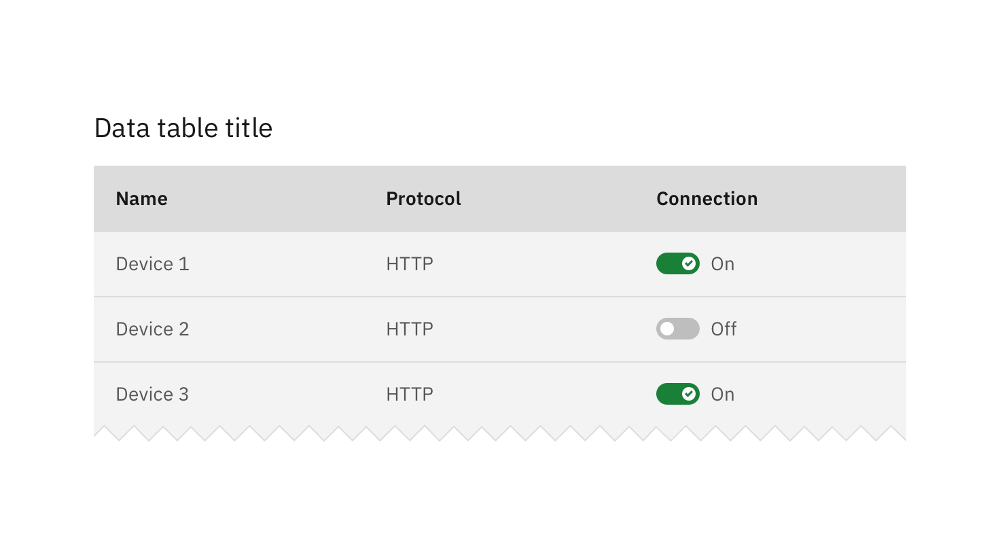

## General guidelines

Toggles are used for binary actions that occur immediately after the user “flips” the Toggle switch. They are commonly used for “On/Off” situations.

    

### Heading

A heading may accompany a Toggle to further clarify on the action the Toggle will perform.

### Labels

Use labels with a Toggle so the action is clear. Labels should be three words or less and appear on both sides of a Toggle.

### Language

Use adjectives rather than verbs to describe labels and the state of the object affected.

## Small toggle

Small toggles are more compact in size, therefore they can be used in use cases such as [Data Tables](/components/data-table/code).

