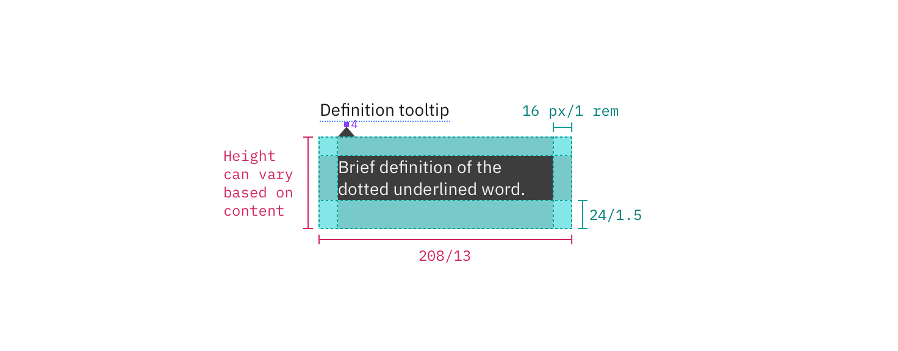

---

title: Tooltip
tabs: ['Code', 'Usage', 'Style']
---

## Color

| Class                                                                                                                                                         | Property         | SCSS        |
| ------------------------------------------------------------------------------------------------------------------------------------------------------------- | ---------------- | ----------- |
| `.bx--tooltip__label`                                                                                                                                         | text color       | $text-01    |
| `svg`                                                                                                                                                         | fill             | $brand-01   |
| `.bx--tooltip--shown`                                                                                                                                         | background-color | $ui-01      |
| `.bx--tooltip`                                                                                                                                                | color            | $text-01    |
| `.bx--tooltip`                                                                                                                                                | border           | $ui-03      |
| `.bx--tooltip__trigger path`                                                                                                                                  | fill             | $brand-01   |
| `.bx--tooltip--definition__bottom p`   `.bx--tooltip--definition__top p`   `.bx--tooltip--icon__top::after`   `.bx--tooltip--icon__bottom::after` | text color       | $inverse-01 |
| `.bx--tooltip--definition__bottom`   `.bx--tooltip--definition__top`   `.bx--tooltip--icon__top::after`   `.bx--tooltip--icon__bottom::after`     | background-color | $inverse-02 |

<ImageComponent fixed="default" caption="Example of closed and open states for a tooltip">

</ImageComponent>

## Typography

Tooltip labels and text should be set in sentence case.

| Property                                                                 | Font-size (px/rem) | Font-weight     | Type styles         |
| ------------------------------------------------------------------------ | ------------------ | --------------- | ------------------- |
| `.bx--tooltip__label`                                                    | 16 / 1             | Semi-Bold / 600 | `.bx--type-epsilon` |
| `.bx--tooltip p`                                                         | 14 / 0.875         | Normal / 400    | -                   |
| `.bx--tooltip--definition__top p`   `.bx--tooltip--icon__top:before` | 12 / 0.75          | Normal / 400    | `.bx--type-caption` |

## Layer

| Class                                                                                                                                                                          | Layer, Elevation | Box-shadow                    |
| ------------------------------------------------------------------------------------------------------------------------------------------------------------------------------ | ---------------- | ----------------------------- |
| `.bx--tooltip`   `.bx--tooltip--icon__top:before`   `.bx--tooltip--icon__bottom:before`   `.bx--tooltip--definition__bottom`   `.bx--tooltip--definition__top` | Overlay, 8       | 0 4px 8px 0 rgba(0,0,0,0.10); |

## Structure

All tooltip types have a varying height based on the amount of content they contain.

### Interactive tooltip

| Class                       | Property      | px / rem | Spacing token |
| --------------------------- | ------------- | -------- | ------------- |
| `.bx--tooltip`              | max-width     | 240 / 15 | -             |
| `.bx--tooltip__trigger svg` | height, width | 16 / 1   | -             |
| `.bx--tooltip__trigger`     | margin-left   | 8 / 0.5  | $spacing-xs   |
| `.bx--tooltip`              | padding       | 16 / 1   | $spacing-md   |
| `.bx--tooltip`              | margin-top    | 8 / 0.5  | $spacing-2xs  |

<ImageComponent fixed="default" caption="Structure and spacing measurements for an interactive tooltip | px / rem">

</ImageComponent>

### Definition tooltip

| Class                                                                    | Property      | px / rem  | Spacing token |
| ------------------------------------------------------------------------ | ------------- | --------- | ------------- |
| `.bx--tooltip--definition__bottom`   `.bx--tooltip--definition__top` | max-width     | 176 / 11  | -             |
| `.bx--tooltip--definition__bottom`   `.bx--tooltip--definition__top` | margin-top    | 12 / 0.75 | $spacing-sm   |
| `.bx--tooltip--definition__bottom`   `.bx--tooltip--definition__top` | padding       | 8 / 0.5   | $spacing-xs   |
| `.bx--tooltip--definition .bx--tooltip__trigger`                         | border-bottom | 2px       | -             |

<ImageComponent fixed="default" caption="Structure and spacing measurements for a definition tooltip | px / rem">

</ImageComponent>

### Icon tooltip

| Class                                                                      | Property  | px / rem | Spacing token |
| -------------------------------------------------------------------------- | --------- | -------- | ------------- |
| `.bx--tooltip--icon__top:before`   `.bx--tooltip--icon__bottom:before` | max-width | 176 / 11 | -             |
| `.bx--tooltip--icon__top:before`   `.bx--tooltip--icon__bottom:before` | padding   | 4 / 0.25 | $spacing-2xs  |

<ImageComponent fixed="default" caption="Structure and spacing measurements for an icon tooltip | px / rem">

</ImageComponent>

### Placement

Tooltips should be placed below the tooltip icon unless it is within the height of the tooltip box plus 16px / 1rem of the bottom of the page. In that instance, the tooltip should appear above the icon or defined word. On mobile, tooltips can only appear below the tooltip icon.

<ImageComponent fixed="default" caption="Placement examples for a tooltip">

</ImageComponent>
