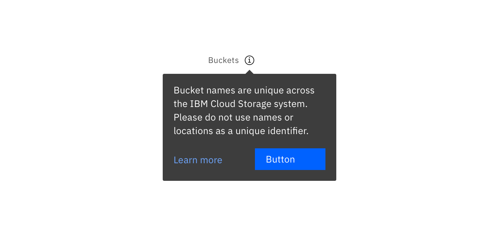

## General guidance

Tooltips provide additional information upon hover or focus.

## Variants

A tooltip is to provide additional, contextual information. Each variant achieves this for different design needs.

### Icon tooltip

An icon tooltip is used to clarify the action or name of an interactive icon button.

<ImageComponent cols="8"  caption="Icon tooltip used to clarify the action or name of an interactive icon button.">

</ImageComponent>

#### Guidance:

* The tooltip content should only contain one or two words.

#### Behavior:

* Icon tooltips appear on `hover` and `focus`.

### Definition tooltip

The definition tooltip provides additional help or defines an item or term. 

<ImageComponent cols="8"  caption="Definition tooltip used to define a Form label.">

</ImageComponent>

#### Guidance:

* Should contain brief, read-only text.
* Use on proper nouns, technical terms, or acronyms with two letters or more
* Do not use a definition tooltip on words with fewer than two letters

#### Behavior:

* Definition tooltips appear on `hover` and `focus`.

### Interactive tooltips

Interactive tooltips contain text and other interactive elements like buttons or links.

<ImageComponent cols="8"  caption="Example of an interactive tooltip.">

</ImageComponent>

Use interactive tooltips when users may be seeking more info than can fit in a definition tooltip.

#### Guidance:

* If a user may need to visit an external resource, like while using a form, include a link in your interactive tooltip.
* Don't use without a label. Consider the context a user needs before clicking a link.

#### Behavior:

* Interactive tooltips appear when the user clicks on an info icon. 
* They persistent until intentionally dismissed by clicking outside of the tooltip.

